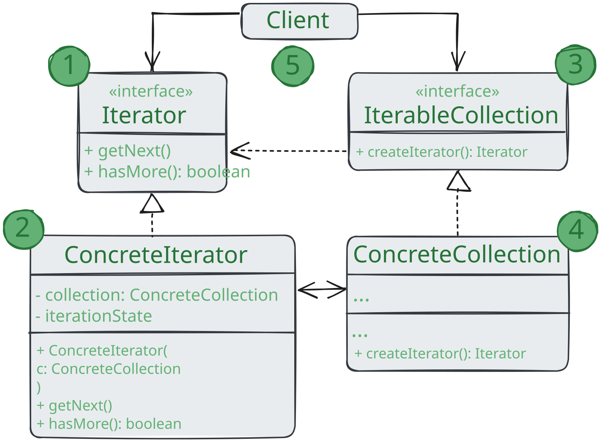

# Итератор

> _Также известен как: Iterator_

**Итератор** - это поведенческий паттерн проектирования,
который даёт возможность последовательно обходить элементы составных объектов,
не раскрывая их внутреннего представления.

### 💔 Проблема

Коллекции - самая распространённая структура данных, которую вы можете встретить в программировании.
Это набор объектов, собранный в одну кучу по каким-то критериям.

Большинство коллекций выглядят как обычный список элементов.
Но есть и экзотические коллекции, простроенные на основе деревьев, графов и других сложных структур данных.

Но как бы ни была структурирована коллекция, пользователь должен иметь возможность последовательно обходить её элементы,
чтобы проделывать с ними какие-то действия.

Но каким способом следует перемещаться по сложной структуре данных?
Например, сегодня может быть достаточным обход дерева в глубину,
но завтра потребуется возможность перемещаться по дереву в ширину.
А на следующей неделе и того хуже - понадобится обход коллекции в случайном порядке.

Добавляя всё новые алгоритма в код коллекции, вы понемногу размываете её основную задачу, 
которая заключается в эффективном хранении данных.
Некоторые алгоритм могут быть и вовсе слишком «заточены»
под определённые приложения и смотреться дико в общем классе коллекции.

### 💚 Решение

Идея паттерна _Итератор_ состоит в том, чтобы вынести поведение обхода коллекции из самой коллекции в отдельный класс.

Объект-итератор будет отслеживать состояние обхода, текущую позицию в коллекции и сколько элементов ещё осталось обойти.
Одну и ту же коллекцию смогут одновременно обходить различные итераторы, а сама коллекция не будет даже знать об этом.

К том же, если вам понадобится добавить новый способ обхода,
вы сможете создать отдельный класс итератора, не изменяя существующий код коллекции.

### Аналогия из жизни

Вы планируете полететь в Рим и обойти все достопримечательности за пару дней. 
Но приехав, вы можете долго петлять узкими улочками, пытаясь найти Колизей.
Если у вас ограниченный бюджет - не беда. Вы можете воспользоваться виртуальным гидом, скачанным на телефон,
который позволит отфильтровать только интересные вам точки. А можете плюнуть и нанять локального гида,
который хоть и обойдется в копеечку, но знает город как свои пять пальцев,
и сможет посвятить вас во все городские легенды.

Таким образом, Рим выступает коллекцией достопримечательностей, а ваш мозг, навигатор или гид - итератором
по коллекции. Вы, как клиентский код, можете выбрать один из итераторов,
отталкиваясь от решаемой задачи и доступных ресурсов.

## Структура

1. **Итератор** описывает интерфейс для доступа и обхода элементов коллекции;
2. **Конкретный итератор** реализует алгоритм обхода какой-то конкретной коллекции.
Объект итератора должен сам отслеживать текущую позицию при обходе коллекции,
чтобы отдельные итераторы могли обходить одну и ту же коллекцию независимо;
3. **Коллекция** описывает интерфейс получения итератора из коллекции.
Как мы уже говорили, коллекции не всегда являются списком. Это может быть и база данных, 
и удалённое API, и даже дерево **Компоновщика**. Поэтому сама коллекция может создавать итераторы,
так как она знает какие именно итераторы способны с ней работать;
4. **Конкретная коллекция** возвращает новый экземпляр определённого конкретного итератора,
связав его с текущим объектом коллекции. Обратите внимание, что сигнатура метода возращает интерфейс итератора.
Это позволяет клиенту не зависеть от конкретных классов итераторов;
5. **Клиент** работает со всеми объектами через интерфейсы коллекции итератора.
Так клиентский код не зависит от конкретных классов, что позволяет применять различные итераторы,
не изменяя существующий код программы. В общем случае клиенты не создаю объекты итераторов, а получают их из коллекций.
Тем не менее, если клиенту требуется специальный итератор, он всегда может создать его самостоятельно.

## Применимость

🪲 **Когда у вас есть сложная структура данных, и вы хотите скрыть
от клиента детали её реализации (из-за сложности или вопросов безопасности).**

_Итератор предоставляет клиенту всего несколько простых методов перебора элементов коллекции.
Это не только упрощает доступ к коллекции, но и защищает её данные от неосторожных или злоумышленных действий._

🪲 **Когда вам нужно иметь несколько вариантов обхода одной и той же структуры данных.**

_Нетривиальный алгоритмы обхода структуры данных могут иметь довольно объёмный код.
Этот код буде захламлять всё вокруг - будь то сам класс коллекции или часть бизнес-логики программы.
Применив итератор, вы можете выделить код обхода структуры данных в собственный класс,
упростив поддержку остального кода._

🪲 **Когда вам хочется иметь единый интерфейс обхода различных структур данных.**

_Итератор позволяет вынести реализации различных вариантов обхода в подклассы.
Это позволит легко взаимозаменять объекты итераторов, в зависимости от того,
с какой структурой данных приходится работать._

## Шаги реализации

1. Создайте общий интерфейс итераторов. Обязательный минимум - это операция получения следующего элемента коллекции.
Но для удобства можно предусмотреть и другое. Например, методы для получения предыдущего элемента, текущей позиции,
проверки окончания обхода и прочие;
2. Создайте интерфейс коллекции и опишите в нём метод получения итератора.
Важно, чтобы сигнатура метода возвращала общий интерфейс итераторов, а не один из конкретных итераторов;
3. Создайте классы конкретных итераторов для тех коллекций, которые нужно обходить с помощью паттерна.
_Итератор_ должен быть привязан только к одному объекту коллекции. Обычно эта связь устанавливается через конструктор;
4. Реализуйте метод получения итератора в конкретных классах коллекций. Они должны создавать новый итератор класса,
который способен работать с данным типом коллекции. 
Коллекция должна передавать ссылку на собственный объект в конструктор итератора;
5. В клиентском коде и в классах коллекций не должно остаться кода обхода элементов.
Клиент должен получать новый итератор из объекта коллекции каждый раз, когда ему нужно перебрать ей элементы.

## Преимущества и недостатки

* ✅ Упрощает классы хранения данных;
* ✅ Позволяет реализовать различные способы обхода структуры данных;
* ✅ Позволяет одновременно перемещаться по структуре данных в разные стороны;
* ❌ Не оправдан, если можно обойтись простым циклом.

## Отношения с другими паттернами

* Вы можете обходить дерево **Компоновщика**, используя **Итератор**;
* **Фабричный метод** можно использовать вместе с **Итератором**,
чтобы подклассы коллекций могли создавать подходящие им итераторы;
* **Снимок** можно использовать вместе с **Итератором**,
чтобы сохранить текущее состояние обхода структуры данных и вернуться к нему в будущем, если потребуется;
* **Посетитель** можно использовать совместно с **Итератором**.
_Итератор_ будет отвечать за обход структуры данных, а _Посетитель_ - за выполнение действий над каждым её компонентом.