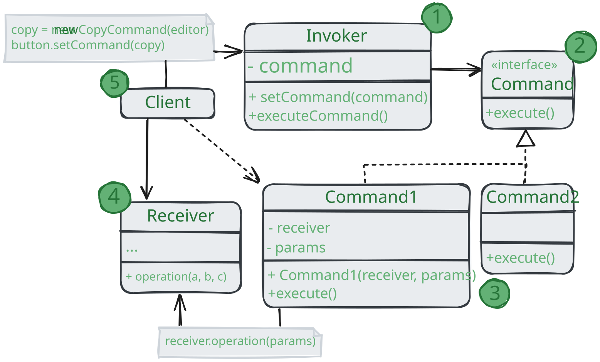

# Команда

> Также известен как: Действие, Транзакция, Action, Command

**Команда** - это поведенческий паттерн проектирования, который превращает запросы в объекты,
позволяя передавать их как аргументы при вызове методов,
ставить запросы в очередь, логировать их, а также поддерживать отмену операций.

### 💔 Проблема

Представьте, что вы работаете надо программой текстового редактора. Дело как раз подошло к разработке панели управления.
Дело как раз подошло к разработке панели управления.
Вы создали класс красивых `Кнопок` и хотите использовать его для всех кнопок приложения, начиная от панели управления,
заканчивая простыми кнопками в диалогах.

Все эти кнопки, хоть и выглядят схоже, но делают разные вещи.
Поэтому возникает вопрос: куда поместить код обработчиков кликов по этим кнопкам?
Самым простым решением было бы сделать подклассы
для каждой кнопки и переопределить в них метод действия под разные задачи.

Но скоро стало понятно, что такой подход никуда не годится. Во-первых, получается очень много подклассов.
Во-вторых, код кнопок, относящийся к графическому интерфейсу, начинает зависеть от классов бизнес-логики,
которая довольно часто меняется.

Но самое обидное ещё впереди. Ведь некоторые операции, например, «сохранить», можно вызвать из нескольких мест:
нажав на кнопку на панели управления, вызвав контекстное меню или просто нажав клавиши `Ctrl+S`.
Когда в программе были только кнопки, код сохранения имелся только в подклассе `SaveButton`.
Но теперь его придётся дублировать ещё в два класса.

### 💚 Решение

Хорошие программы обычно структурированы в виде слоёв.
Самый распространённый пример - слои пользовательского интерфейса и бизнес-логики.
Первый всего лишь рисует красивую картинку для пользователя. Но когда нужно сделать что-то важное,
интерфейс «просит» слой бизнес-логики заняться этим.

В реальности это выглядит так: один из объектов интерфейса напрямую вызывает метод одного из объектов бизнес-логики,
передавая в него какие-то параметры.

Паттерн _Команда_ предлагает больше не отправлять такие вызовы напрямую.
Вместо этого каждый вызов, отличающийся от других, следует завернуть в собственный класс с единственным методом,
который и будет осуществлять вызов. Такие объекты называют _командами_.

К объекту интерфейса можно будет привязать объект команды, который занет,
кому и в каком виде следует отправлять запросы. Когда объект интерфейса будет готов передать запрос,
он вызовет метод команды, а та - позаботится обо всём остальном.

Классы команд можно объединить под общим интерфейсом с единственным методом запуска.
После этого одни и те же отправители смогут работать с различными командами, не привязываясь к их классам.
Даже больше: команды можно будет взаимозаменять на лету, изменяя итоговое поведение отправителей.

Параметры, с которым должен быть вызван метод объекта получателя, можно загодя сохранить в полях объета-команды.
Благодаря этому, объекты, отправляющий запросы, могут не беспокоиться о том,
чтобы собрать необходимые для получателя данные. Более того, они теперь вообще не знают, кто будет получателем запроса.
Вся эта информация скрыта внутри команды.

После применения _Команды_ в нашем примере с текстовым редактором
вам больше не потребуется создавать уйму подклассов кнопок под разные действия.
Будет достаточно единственного класса с полем для хранения объекта команды.

Используя общий интерфейс команд, объекты кнопок будут ссылаться на объекты команд различных типов.
При нажатии кнопки будут делегировать работу связанным командам,
а команды - перенаправлять вызовы тем или иным объектам бизнес-логики.

Так же можно поступить и с контекстным меню, и с горячими клавишами.
Они будут привязаны к тем же объектам команд, что и кнопки, избавляя классы от дублирования.

Таким образом, команды станут гибкой прослойкой между пользовательским интерфейсом и бизнес-логикой.
И это лишь малая доля пользы, которую может принести паттерн _Команда_!

### Аналогия из жизни

Вы заходите в ресторан и садитесь у окна.
К вам подходит вежливый официант и принимает заказ, записывая все пожелания в блокнот.
Откланявшись, он уходит на кухню, где вырывает лист из блокнота и клеит на стену. 
Далее лист оказывается в руках повара, который читает содержание заказа и готовит заказанные блюда.

В этом примере вы являетесь _отправителем_, официант с блокнотом - _командой_, а повар _получателем_.
Как и паттерне, вы не соприкасаетесь напрямую с поваром. Вместо этого вы отправляете заказ с официантом,
который самостоятельно «настраивает» повара на работу. С другой стороны, повар не знает, кто конкретно послал ему заказ.
Но это ему безразлично, так как вся необходимая информация есть в листе заказа.

## Структура

1. **Отправитель** хранит ссылку на объект команды и обращается к нему, когда нужно выполнить какое-то действие.
Отправитель работает с командами только через их общий интерфейс. 
Он не знает, какую конкретно команду использует, так как получает готовый объект команды от клиента;
2. **Команды** описывает общий для всех конкретных команд интерфейс.
Обычно здесь описан всего один метод для запуска команды;
3. **Конкретные команды** реализуют различные запросы, следуя общему интерфейсу команд.
Обычно команда не делает всю работу самостоятельно, а лишь передаёт вызов получателю,
которым является один из объектов бизнес-логики.
Параметры, с которыми команда обращается к получателю, следует хранить в виде полей.
В большинстве случаев объект команд можно сделать неизменяемым,
передавая в них все необходимые параметры только через конструктор;
4. **Получатель** содержит бизнес-логику программы. В этой роли может выступать практически любой объект.
Обычно команды перенаправляют вызовы получателям.
Но иногда, чтобы упростить программу, вы можете избавиться от получателей, «слив» их код в классы команд;
5. **Клиент** создаёт объекты конкретных команд, передавая в них все необходимые параметры,
среди которых могут быть ссылки на объекты получателей. После этого клиент связывает объекты отправителей с созданными командами.

## Применимость

🪲 **Когда вы хотите параметризовать объекты выполняемым действием.**

_Команда превращает операции в объекты. А объекты можно передавать, хранить и взаимозаменять внутри других объектов.
Скажем, вы разрабатываете библиотеку графического меню и хотите,
чтобы пользователи могли использовать меню в разных приложениях, не меняя каждый раз код ваших классов. 
Применив паттерн, пользователям не придётся изменять классы меню,
вместо этого они будут конфигурировать объекты меню различными командами._

🪲 **Когда вы хотите ставить операции в очередь, выполнять их по расписанию или передавать по сети.**

_Как и любые другие объекты, команды можно сериализовать, то есть превратить в строку, чтобы потом сохранить
в файл или базу данных. Затем в любой удобный момент её можно достать обратно,
снова превратить в объект команды и выполнить.
Таким же образом команды можно передавать по сети, логировать или выполнять на удаленном сервере._

🪲 **Когда вам нужна операция отмены.**

_Главная вещь, которая вам нужна, чтобы иметь возможность отмены операции - это хранение истории.
Среди многих способов, которыми можно это сделать, паттерн Команда является, пожалуй, самым популярным.
История команд выглядит как стек, в который попадают все выполненные объект команд.
Каждая команда перед выполнением операции сохраняет текущее состояние объекта, с которым она будет работать.
После выполнения операции копия команды попадает в стек истории, все ещё неся в себе сохранённое состояние объекта.
Если потребуется отмена, программа возьмёт последнюю команду из истории и возобновить сохранённое в ней состояние.
Этот способ имеет две особенности. Во-первых, точное состояние объектов не так-то просто сохранить,
ведь часть его может быть приватым. Но с этим может помочь справиться паттерн **Снимок**.
Во-вторых, копии состояния могут занимать довольно много оперативной памяти.
Поэтому иногда можно прибегнуть к альтернативной реализации,
когда вместо восстановления старого состояния команда выполняет обратное действие.
Недостаток этого способа в сложности (а иногда и невозможности) реализация обратного действия._

## Шаги реализации

1. Создайте общий интерфейс команд и определите в нём метод запуска;
2. Один за другим создайте классы конкретных команд.
В каждом классе должно быть поле для хранения ссылки на один или несколько объектов-получаелей,
которым команда будет перенаправлять основную работу. Кроме этого, команда должна иметь поля для хранения параметров,
которые нужны при вызове методов получателя. Значения всех этих полей команда должна получать через конструктор.
И, наконец, реализуйте основной метод команды, вызывая в нём те или иные методы получателя;
3. Добавьте в классы отправителей поля для хранения команд.
Обычно объекты-отправители принимают готовые объекты команды извне - через конструктор либо через сеттер поля команды;
4. Измените основной код отправителей так, чтобы они делегировали выполнение действия команде;
5. Порядок инициализации объектов должен выглядеть так:
   * Создаём объекты получателей;
   * Создаём объекты команды, связав их с получателями;
   * Создаём объекты отправителей, связав их с командами.

## Преимущества и недостатки

* ✅ Убираем прямую зависимость между объектами, вызывающими операции,
и объектами, которые их непосредственно выполняют;
* ✅ Позволят реализовывать простую отмену и повтор операций;
* ✅ Позволяет реализовывать отложенный запуск операций;
* ✅ Позволяет собирать сложные команды из простых;
* ✅ Реализует _принцип открытости/закрытости_;
* ❌ Усложняет код программы из-за введения множества дополнительных классов.

## Отношения с другими паттернами

* **Цепочка обязанностей**, **Команда**, **Посредник** и **Наблюдатель** показывают
  различные способы работы отправителей запросов с их получателями:
    * _Цепочка обязанностей_ передаёт запрос последовательно через цепочку потенциальных получателей,
      ожидая, что какой-то из них обработает запрос;
    * _Команда_ устанавливает косвенную одностороннюю связь от отправителей к получателям;
    * _Посредник_ убирает прямую связь между отправителями и получателями,
      заставляя их общаться опосредованно, через себя;
    * _Наблюдатель_ передаёт запрос одновременно всем заинтересованным получателям,
      но позволяет им динамически подписываться или отписываться от таких оповещений.
* Обработчики в **Цепочке обязанностей** могу быть выполнены в виде **Команды**.
  В этом случае множеств разных операций может быть выполнено над одним и тем же контекстом, коим является запрос.
  Но есть и другой подход, в котором сам запрос является _Командой_, посланной по цепочке объектов.
  В этом случае ода и та же операция может быть выполнена над множеством разных контекстов, представленных в виде цепочки;
* **Команду** и **Снимок** можно использовать сообща для реализации отмены операции.
В этом случае объекты команд будут отвечать за выполнение действия над объектом,
а снимки будут хранить резервную копию состояния этого объекта, сделанную перед самым запуском команд.
* **Команда** и **Стратегия** похожи по духу, но отличаются масштабом и применением:
  * _Команду_ используют, чтобы превратить любые разнородные действия в объекты.
  Параметры операции превращаются в поля объекта. Этот объект теперь можно логировать, хранить в истории для отмены,
  передавать во внешние сервисы и так далее;
  * С другой стороны, _Стратегия_ описывает разные способы произвести одни и то же действие,
  позволяя взаимозаменять эти способы в каком-то объекте контекста.
* Если **Команду** нужно копировать перед вставкой в историю выполненных команд, вам может помочь **Прототип**;
* **Посетитель** можно рассматривать как расширенный аналог **Команды**,
который способен работать сразу с несколькими видами получателей.