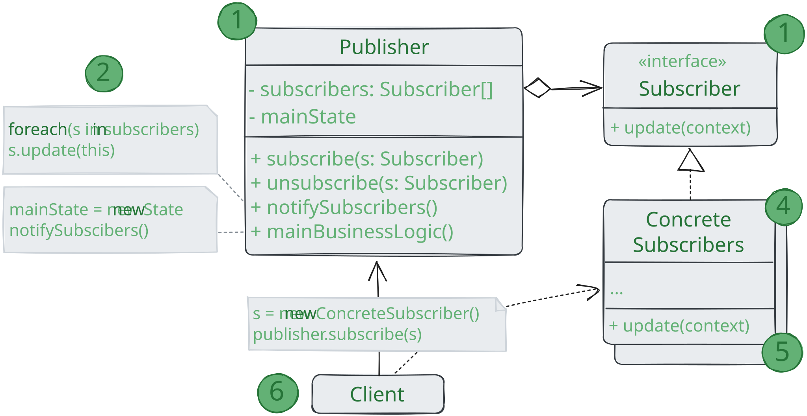

# Наблюдатель

> _Также известен как: Издатель-Подписчик, Слушатель, Observer_

**Наблюдатель** - это поведенческий паттерн проектирования,
который создаёт механизм подписки позволяющий одним объектам следить и реагировать на события,
происходящие в других объектах.

### 💔 Проблема

Представьте, что вы имеете два объекта: `Покупатель` и `Магазин`. В магазин вот-вот должны завести новый товар,
который интересен покупателю. 

Покупатель может каждый день ходить в магазин, чтобы проверить наличие товара.
Но при этом он будет злиться, без толку тратя своё драгоценное время.

С другой стороны, магазин может разослать спам каждому покупателю.
Многих это расстроит, так как товар специфический, и не всем он нужен.

Получается конфликт: любо покупатель тратит время на периодические проверки,
либо магазин тратит ресурсы на бесполезные оповещения.

### 💚 Решение

Давайте называть `Издателями` те объекты, которые содержат важное или интересное для других состояние.
Остальные объекты, которые хотят отслеживать изменения этого состояния, назовём `Подписчиками`.

Паттерн _Наблюдатель_ предлагает хранить внутри объекта издателя список ссылок на объекты подписчиков,
причём издатель не должен вести список подписки самостоятельно.
Он предоставит методы, с помощью который подписчики могли бы добавлять или убирать себя из списка.

Теперь самое интересное.
Когда в издателе будет происходить важное событие,
он будет проходиться по списку подписчиков и оповещать их об этом,
вызывая определённый метод объектов подписчиков.

Издателю безразлично, какой класс будет иметь тот или иной подписчик,
так как все они должны следовать общему интерфейсу и иметь единый метод оповещения.

Увидев, как складно всё работает, вы можете выделить общий интерфейс, описывающий методы подписки и отписки,
и для всех издателей.
После этого подписчики смогут работать с разными типами издателей,
а также получать оповещения от них через один и тот же метод.

### Аналогия из жизни

После того как вы оформили подписку на газету или журнал, вам больше не нужно ездить в супермаркет и проверять не вышел 
ли очередной номер.
Вместо этого издательство будет присылать новые номера по почте прямо к вам домой сразу после из выхода.

Издательство ведёт список подписчиков и знает кому какой журнал высылать.
Вы можете в любой момент отказаться от подписки, и журнал перестанет вам приходить.

## Структура

1. **Издетель** владеет внутренним состоянием, изменение которого интересно отслеживать подписчиками.
Издатель содержит механизм подписки: список подписчиков и методы подписки/отписки;
2. Когда внутреннее состояние издателя меняется, он оповещает своих подписчиков.
Для этого издатель проходит по списку подписчиков и вызывает их метод оповещения,
заданный в общем интерфейсе подписчиков;
3. **Подписчик** определяет интерфейс, которым пользуется издатель для отправки оповещения.
В большинстве случаев для этого достаточно единственного метода;
4. **Конкретные подписчики** выполняют что-то в ответ на оповещение, пришедшее от издателя. 
Эти классы должны следовать общему интерфейсу подписчиков, чтобы издатель не зависел от конкретных классов подписчиков;
5. По приходу оповещения подписчику нужно получить обновлённое состояние издателя.
Издатель может передать это состояние через параметры метода оповещения.
Более гибкий вариант - передавать через параметры весь объект издателя,
чтобы подписчик мог сам получить требуемые данные.
Как вариант, подписчик может постоянно хранить ссылку на объект издателя, переданный ему в конструкторе;
6. **Клиент** создаёт объекты издателей и подписчиков, а затем регистрирует подписчиков на обновления в издателях.

## Применимость

🪲 **Когда после изменения состояния одного объекта требуется что-то сделать в других,
но вы не знаете наперёд, какие именно объекты должны отреагировать.**

_Описанная проблема может возникнуть при разработке библиотек пользовательского интерфейса
когда вам надо дать возможность сторонним классам реагировать на клики по кнопкам.
Паттерн наблюдатель позволяет любому объекту с интерфейсом подписчика
зарегистрироваться на получение оповещений о событиях, происходящий в объектах-издателях._

🪲 **Когда одни объекты должны наблюдать за другими, но только в определённых случаях.**

_Издатели ведут динамические списки.
Все наблюдатели могут подписываться или отписываться от получения оповещений прямо во время выполнения программы._

## Шаги реализации

1. Разбейте вашу функциональность на две части: независимое ядро станет издателем.
Зависимые части станут подписчиками;
2. Создайте интерфейс подписчиков. Обычно в нём достаточно определить единственный метод оповещения;
3. Создайте интерфейс издателей и опишите в нём операции управления подпиской.
Помните, что издатель должен работать только с общим интерфейсом подписчиков;
4. Вам нужно решить, куда поместить код ведения подписки, ведь он обычно бывает одинаков для всех типов издателей.
Самый очевидный способ - вынести этот код в промежуточный абстрактный класс,
от которого будут наследоваться все издатели. Но если вы интегрируете паттерн в существующие классы,
то создать новый базовый класс может быть затруднительно.
В этом случае вы можете поместить логику подписки во вспомогательный объект и делегировать ему работу из издателей;
5. Создайте классы конкретных издателей.
Реализуйте из так, чтобы после каждого изменения состояния они отправляли оповещения всем своим подписчикам;
6. Реализуйте метод оповещения в конкретных подписчиках. Не забудьте предусмотреть параметры,
через которые издатель могу бы отправлять какие-то данные, связанные с происшедшим событием.
Возможен и друг вариант, когда подписчик, получив оповещение, вам возьмёт из объекта издателя нужные данные.
Но в этом случае вы будете вынуждены привязать класс подписчика к конкретному классу издателя.
7. Клиент должен создавать необходимое количество объектов подписчиков и подписывать их у издателей.

## Преимущества и недостатки

* ✅ Издатели не зависят от конкретных классов подписчиков и наоборот;
* ✅ Вы можете подписывать и отписывать получателй на лету;
* ✅ Реализует принцип _открытости/закрытости_;
* ❌ Подписчики оповещаются в случайном порядке. 

## Отношения с другими паттернами

* **Цепочка обязанностей**, **Команда**, **Посредник** и **Наблюдатель** показывают
  различные способы работы отправителей запросов с их получателями:
    * _Цепочка обязанностей_ передаёт запрос последовательно через цепочку потенциальных получателей,
      ожидая, что какой-то из них обработает запрос;
    * _Команда_ устанавливает косвенную одностороннюю связь от отправителей к получателям;
    * _Посредник_ убирает прямую связь между отправителями и получателями,
      заставляя их общаться опосредованно, через себя;
    * _Наблюдатель_ передаёт запрос одновременно всем заинтересованным получателям,
      но позволяет им динамически подписываться или отписываться от таких оповещений.
* Разница между **Посредником** и **Наблюдателем** не всегда очевидна.
  Чаще всего они выступают как конкуренты, но иногда могут работать вместе.
  Цель _Посредника_ - убрать обоюдные зависимости между компонентами системы.
  Вместо этого они становятся зависимыми от самого посредника.
  С другой стороны, цель _Наблюдателя_ - обеспечить динамическую одностороннюю связь,
  в которой одни объекты косвенно зависят от других. Довольно популярна реализация _Посредника_ при помощи _Наблюдателя_.
  При этом объект посредника будет выступать издателем,
  а все остальные компоненты станут подписчиками и смогут динамически следить за событиями, происходящими в посреднике.
  В этом случае трудно понять, чем же отличаются оба паттерна. Но _Посредник_ имеет и другие реализации,
  когда отдельные компоненты жёстко привязаны к объекту посредника.
  Такой код вряд ли будет напоминать _Наблюдателя_, но всё же останется _Посредником_.
  Напротив, в случае реализации посредника с помощью _Наблюдателя_ представим такую программу, в которой каждый компонент
  системы становится издателем. Компоненты могут подписываться друг на друга,
  в то же время не привязываясь к конкретным классам. Программа будет состоять из целой сети _Наблюдателей_,
  не имея центрального объекта-_Посредника_.
