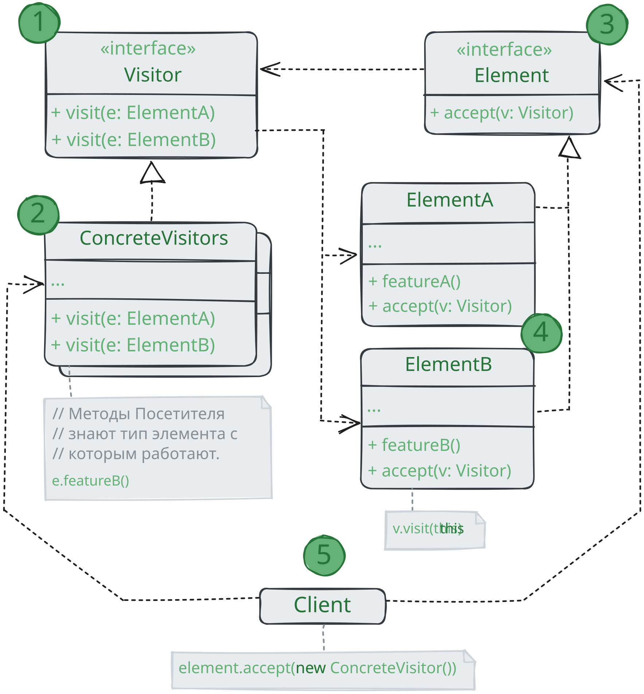

# Посетитель

> _Также известны как: Visitor_

**Посетитель** - это поведенческий паттерн проектирования,
позволяющий добавлять в программу новые операции,
не изменяя классы объектов,
над которыми эти операции могут выполняться.

### 💔 Проблема

Ваша команда разрабатывает приложение, работающее с геоданными в виде графа.
Узлами графа являются городские локации: памятники, театры, рестораны, важные предприятия и прочее.
Каждый узел имеет ссылки на другие, ближайшие к нему узлы. Каждому типу узлов соответствует свой класс,
а каждый узел представлен отдельным объектом.

Ваша задача - сделать экспорт этого графа в XML.
Дело было бы плёвым, если бы вы могли добавить метод экспорта в каждый тип узла,
а затем, перебирая узлы графа, вызывать этот метод для каждого узла.
Благодаря полиморфизму, решение получилось бы изящным,
так как вам не пришлось бы привязываться к конкретным классам узлов.

Но, к сожалению, классы узлов вам изменить не удалось. Системный архитектор сослался на то,
что код классов узлов сейчас очень стабилен, и от него многое зависит,
поэтому он не хочет рисковать и позволять кому-либо его трогать.

К тому же он сомневался в том, что экспорт в XML вообще уместен в рамках этих классов.
Их основная задача была связана с геоданными, а экспорт выгляди в рамках этих классов чужеродно.
Была и ещё дна причина запрета. Если на следующей недели вам понадобился экспорт в какой-то другой формат данных,
то эти классы снова пришлось бы менять.

### 💚 Решение

Паттерн Посетитель предлагает разместить новое поведение в отдельном классе,
вместо того чтобы множить его сразу в нескольких классах.
Объекты, с которыми должно было быть связано поведение, не будут выполнять его самостоятельно.
Вместо этого вы будете передавать эти объекты в методы посетителя.

Код поведения, скорее всего, должен отличаться для объектов разных классов,
поэтому и методов у посетителя должно быть несколько. Названия и принцип действия этих методов будут схож,
но основное отличие будет в типе принимаемого в параметрах объекта.

Здесь возникает вопрос: как подавать узлы в объект-посетитель? Так как все методы имею отличающуюся сигнатуру,
использовать полиморфизм при переборе узлов не получится. Придётся проверять тип узлов для того,
чтобы выбрать соответствующий метод посетителя.

Тут не поможет даже механизм перегрузки методов (доступный в Java и C#). Если назвать все методы одинаково,
то неопределённость реального типа узла всё равно не даст вызвать правильный метод.
Механизм перегрузки всё время будет вызывать метод посетителя, соответствующий типу `Node`,
а не реального класса поданного узла.

Но Паттерн Посетитель решает и эту проблему, используя механизм двойной диспетчеризации.
Вместо того, чтобы самим искать нужный метод мы можем поручить это объектам, которые передаем в параметрах посетителю.
А они уже вызовут правильный метод посетителя.

Как видите, изменить классы узлов всё-таки придётся.
Но это простое изменение позвоит применять к объектам узлов и другие поведения,
ведь классы узлов будут привязаны не к конкртеному классу посетителей, а к их общему интерфейсу.
Поэтому если придётся добавить в программу новое поведение,
вы создадите новый класс посетителя и будете передавать его в методы узлов.

## Аналогия из жизни

Представьте начинающего страхового агента, жаждущего получить новых клиентов. 
Он беспорядочно посещает все дома в округе, предлагая свои услуги. 
Но для каждого из посещаемых _типов_ домов у него имеется особое предложение. 

* Придя в дом к обычной семье, он предлагает оформить медицинскую страховку;
* Придя в бане, он предлагает страховку от грабежа;
* Придя на фабрику, он предлагает страховку предприятия от пожара наводнения.

## Структура

1. **Посетитель** описывает общий интерфейс для всех типов посетителей.
Он объявляет набор методов, отличающихся типом входящего параметра,
которые нужны для запуска операции для всех типов конкретных элементов. В языках, поддерживающих перегрузку методов,
эти методы могут иметь одинаковые имена, но типы их параметров должны отличаться;
2. **Конкретные посетители** реализуют какое-то особенное поведение для всех типов элементов,
которые можно подать через методы интерфейса посетителя;
3. **Элемент** описывает метод _принятия_ посетителя.
Этот метод должен иметь единственный параметр, объявленный типом интерфейса посетителя;
4. **Конкретные элементы** реализуют методы _принятия_ посетителя. Цель этого метода - вызвать тот метод посещения, 
который соответствует типу этого элемента. Так посетитель узнает, с каким именно элементом он работает;
5. **Клиентом** зачастую выступает коллекция или сложный составной объект, например, дерево **Компоновщика**.
Зачастую клиент привязан к конкретным классам элементов, работая с ними через общий интерфейс элементов.

## Применимость

🪲 **Когда вам нужно выполнить какую-то операцию над всеми элементами сложной структуры объектов, например, деревом.**

_Посетитель позволяет применять одну и ту же операцию к объектам различных классов._

🪲 **Когда над объектами сложной структуры объектов надо выполнять некоторые не связанные между собой операции,
но вы не хотите «засорять» классы такими операциями.**

_Посетитель позволяет извлечь родственные операции из классов,
составляющих структуру объектов, поместив их один класс-посетитель.
Если структура объектов является общей для нескольких приложений,
то паттерн в каждое приложение включит только нужные операции._

🪲 **Когда новое поведение имеет смысл только для некоторых классов из существующих иерархий.**

_Посетитель позволяет определить поведение только для этих классов, оставив его пустым для всех остальных._

## Шаги реализации

1. Создайте интерфейс посетителя и объявите в нём
методы «посещения» для каждого класса элемента, который существует в программе;
2. Опишите интерфейс элементов. Если вы работаете с уже существующими классами,
то объявите абстрактный метод принятия посетителей в базовом классе иерархии элементов;
3. Реализуйте методы принятия во всех конкретных элементах.
Они должны переадресовывать вызовы тому методу посетителя, в котором тип параметра совпадает с текущим классом элемента;
4. Иерархия элементов должна знать только о базовом интерфейсе посетителей.
С другой стороны, посетители будут знать обо всех классах элементов;
5. Для каждого нового поведения создайте конкретный класс посетителя.
Приспособьте это поведение для работы со всем типами элементов, реализовав все методы интерфейса посетителя.
Вы можете столкнуться с ситуацией, когда посетителю нужно будет доступ к приватным полям элементов.
В этом случае вы можете либо раскрыть доступ к этим полям, нарушив инкапсуляцию элементов,
либо сделать класс посетителя вложенным в класс элемента,
если вам повезло писать на языке, который поддерживает вложенность классов;
6. Клиент будет создавать объекты посетителей, а затем передавать их элементам, используя метод принятия.

## Преимущества и недостатки

* ✅ Упрощает добавление операций, работающих со сложными структурами объектов;
* ✅ Объединяет родственные операции в одном классе;
* ✅ Посетитель может накапливать состояние при обходе структуры элементов;
* ❌ Паттерн не оправдан, если иерархия элементов часто меняется;
* ❌ Может привести к нарушению инкапсуляции элементов.

## Отношения с другими паттернами

* **Посетитель** можно рассматривать как расширенный аналог **Команды**,
который способен работать сразу с несколькими видами получателей;
* Вы можете выполнить какое-то действие над всем деревом **Компоновщика** при помощи **Посетителя**;
* **Посетитель** можно использовать совместно с **Итератором**.
_Итератор_ будет отвечать за обход структуры данных, а _Посетитель_ - за выполнение действий над каждым её компонентом.