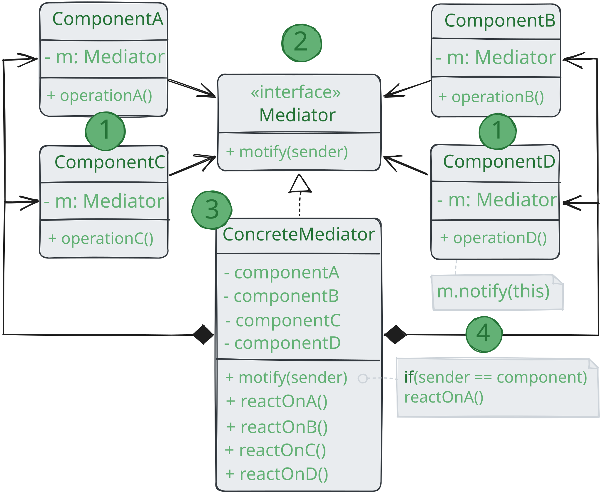

# Посредник

> _Также известен как: Intermediary, Controller, Mediator_

**Посредник** - это поведенческий паттерн проектирования,
который позволяет уменьшить связанность классов между собой,
благодаря перемещению этих связей в один класс-посредник.

### 💔 Проблема

Предположим, что у вас есть диалог создания профиля пользователя.
Он состоит их всевозможных элементов управления - текстовых полей, чекбоксов, кнопок.

Отдельные элементы диалога должны взаимодействовать друг с другом.
Так, например, чекбокс «у меня есть собака» открывает скрытое поле для ввода имени домашнего любимца,
а клик по кнопке отправки запускает проверку всех полей формы.

Прописав эту логику прямо в коде элементов управления,
вы поставите крест на их повторном использовании в других местах приложения.
Они станут слишком тесно связаны с элементами диалога редактирования профиля,
которые не нужно в других местах контекста. Поэтому вы сможете использовать либо все элементы сразу, либо ни одного.

### 💚 Решение

Паттерн _Посредник_ заставляет объекты общаться не напрямую друг с другом, а через отдельный объект-посредник,
который знает, кому нужно перенаправить тот или иной запрос.
Благодаря этому, компоненты системы будут зависеть только от посредника, а не от десятков других компонентов.

В нашем примере посредником мог бы стать диалог. Скорее всего, класс диалога и так знает, из каких элементов состоит,
поэтому никаких новых связей добавлять в него не придётся.

Основные изменения произойдут внутри отдельных элементов диалога. Если раньше при получении клика от
пользователя объект кнопки сам проверял значения полей диалога,
то теперь его единственно обязанностью будет сообщить диалогу о том, что произошёл клик.
Получив извещение, диалог выполнит все необходимые проверки полей. Таким образом,
вместо нескольких зависимостей от остальных элементов кнопка получит только одну - от самого диалога.

Чтобы сделать код ещё более гибким, можно выделить общий интерфейс для всех посредников, то есть диалогов программы.
Наша кнопка станет зависимой не от конкретного диалога создания пользователя,
а от абстрактного, что позволит использовать её в других диалогах.

Таким образом, посредник скрывает в себе все сложные связи и зависимости между классам отдельных компонентов программы.
А чем меньше связей имеют классы, тем проще их изменять, расширять и повторно использовать.

### Аналогия из жизни

Пилоты садящихся или улетающих самолётов не общаются напрямую с другими пилотами.
Вместо этого они связываются с диспетчером, который координирует действия нескольких самолётов одновременно.
Без диспетчера пилотам приходилось бы все время быть начеку и следить за всеми окружающими самолётами самостоятельно,
а это приводило бы к частым катастрофам в небе.

Важно понимать, что диспетчер не нужен во время всего
полёта. Он задействован только в зоне аэропорта, когда
нужно координировать взаимодействие многих самолётов.

## Структура

1. **Компоненты** — это разнородные объекты, содержащие бизнес-логику программы.
Каждый компонент хранит ссылку на объект посредника, но работает с ним только через абстрактный интерфейс посредников.
Благодаря этому, компоненты можно повторно использовать в другой программе, связав их с посредником другого типа;
2. **Посредник** определяет интерфейс для обмена информацией для обмена информацией с компонентами.
Обычно хватает одного метода, чтобы оповещать посредника о событиях, произошедших в компонентах. 
В параметрах этого метода можно передавать детали: ссылку на компонент, в котором оно произошло и любые другие данные;
3. **Конкретный посредник** содержит код взаимодействия нескольких компонентов между собой.
Зачастую этот объект не только хранит ссылки на все свои компоненты, но и сам их создаёт, управляя жизненным циклом;
4. Компоненты не должны общаться друг с другом напрямую.
Если в компоненте происходит важное событие, он должен оповестить своего посредника,
а тот сам решит - касается ли событие других компонентов, и стоит ли их оповещать.
При этом компонент-отправитель не знает кто обрабатывает его запрос, а компонент-получатель не знает кто его прислал. 

## Применимость

🪲 **Когда вам сложно менять некоторые классы из-за того,
что они имеют множество хаотичных связей с другими классами.**

_Посредник позволяет поместить все эти связи в один класс, после чего вам будет легче их отрефакторить,
сделать более понятными и гибкими._

🪲 **Когда вы не можете повторно использовать класс, поскольку он зависит от уймы других классов.**

_После применения паттерна компоненты теряют прежние связи с другими компонентами,
а всё их общение происходит косвенно, через объект-посредник._

🪲 **Когда вам приходится создавать множество подклассов компонентов,
чтобы использовать одни и те же компоненты в разных контекстах.**

_Если раньше изменение отношений в одном компоненте могли повлечь за собой лавину
изменений во всех остальных компонентах,
то теперь вам достаточно создать класс посредника и поменять в нём связи между компонентами._

## Шаги реализации

1. Найдите группу тесно переплетённых классов, отвязав которые друг от друга, можно получить некоторую пользу.
Например, чтобы повторно использовать их код в другой программе;
2. Создайте общий интерфейс посредников и опишите в нем методы для взаимодействия с компонентами.
В простейшем случае достаточно одного метода для получения оповещений от компонентов.
Этот интерфейс необходим, если вы хотите повторно использовать классы компонентов для других задач.
В этом случае всё, что нужно сделать - это создать новый класс конкретного посредника;
3. Реализуйте этот интерфейс в классе конкретного посредника.
Поместите в него поля, которые будут содержать ссылки на все объекты компонентов;
4. Вы можете пойти дальше и переместить код создания компонентов в класс посредника
после чего он может напоминать фабрику или фасад;
5. Компоненты тоже должны иметь ссылку на объект посредника. Связь между ними удобнее всего установить,
подавая посредника в параметры конструктора компонентов;
6. Измените код компонентов так, чтобы они вызывали метод оповещения посредника, вместо методов других компонентов.
С противоположной стороны, посредник должен вызывать методы нужного компонента, когда получает оповещение от компонента.

## Преимущества и недостатки

* ✅ Уменьшает зависимость между компонентами, позволяя повторно их использовать;
* ✅ Упрощает взаимодействие между компонентами;
* ✅ Централизует управление в одном месте;
* ❌ Посредник может сильно раздуваться.

## Отношение с другими паттернами

* **Цепочка обязанностей**, **Команда**, **Посредник** и **Наблюдатель** показывают
  различные способы работы отправителей запросов с их получателями:
    * _Цепочка обязанностей_ передаёт запрос последовательно через цепочку потенциальных получателей,
      ожидая, что какой-то из них обработает запрос;
    * _Команда_ устанавливает косвенную одностороннюю связь от отправителей к получателям;
    * _Посредник_ убирает прямую связь между отправителями и получателями,
      заставляя их общаться опосредованно, через себя;
    * _Наблюдатель_ передаёт запрос одновременно всем заинтересованным получателям,
      но позволяет им динамически подписываться или отписываться от таких оповещений.
* **Посредник** и **Фасад** походи тем, что пытаются организовать работу множества существующих классов:
    * _Фасад_ создаёт упрощённый интерфейс к подсистеме, но внося в неё никакой добавочной функциональности.
      Сама подсистема не знает о существовании _Фасада_. Классы подсистемы общаются друг с другом напрямую;
    * _Посредник_ централизует общение между компонентами системы.
      Компоненты системы знают только о существовании _Посредника_, у них нет прямого доступа к другим компонентам.
* Разница между **Посредником** и **Наблюдателем** не всегда очевидна.
Чаще всего они выступают как конкуренты, но иногда могут работать вместе.
Цель _Посредника_ - убрать обоюдные зависимости между компонентами системы.
Вместо этого они становятся зависимыми от самого посредника.
С другой стороны, цель _Наблюдателя_ - обеспечить динамическую одностороннюю связь,
в которой одни объекты косвенно зависят от других. Довольно популярна реализация _Посредника_ при помощи _Наблюдателя_.
При этом объект посредника будет выступать издателем,
а все остальные компоненты станут подписчиками и смогут динамически следить за событиями, происходящими в посреднике.
В этом случае трудно понять, чем же отличаются оба паттерна. Но _Посредник_ имеет и другие реализации,
когда отдельные компоненты жёстко привязаны к объекту посредника.
Такой код вряд ли будет напоминать _Наблюдателя_, но всё же останется _Посредником_.
Напротив, в случае реализации посредника с помощью _Наблюдателя_ представим такую программу, в которой каждый компонент
системы становится издателем. Компоненты могут подписываться друг на друга,
в то же время не привязываясь к конкретным классам. Программа будет состоять из целой сети _Наблюдателей_,
не имея центрального объекта-_Посредника_.