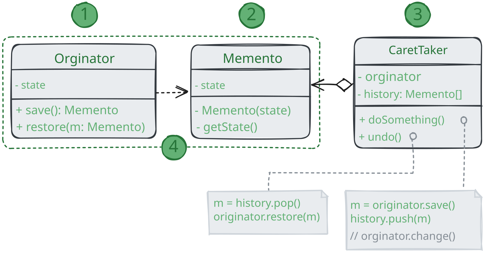
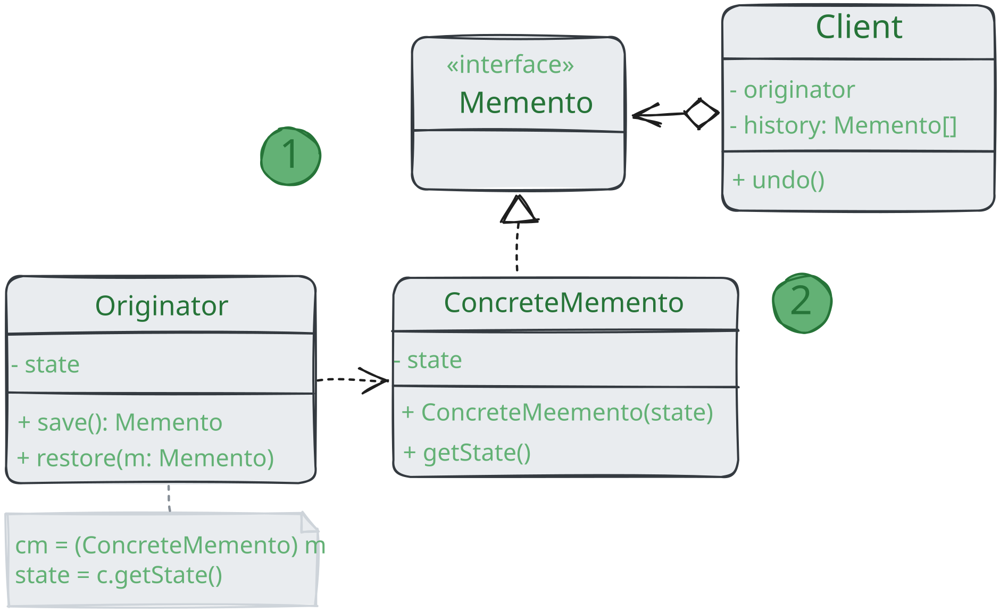
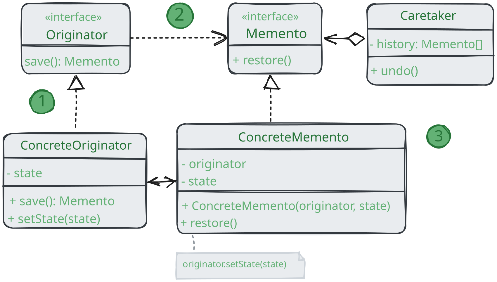

# Снимок

> _Также известен как: Хранитель, Memento_

**Снимок** - это поведенческий паттерн проектирования,
который позволяет сохранять и восстанавливать прошлые состояния объектов, не раскрывая подробностей их реализации.

### 💔 Проблема

Предположим, что вы пишите программу текстового редактора. Помимо обычного редактирования,
ваш редактор позволяет менять форматирование текста, вставлять картинки и прочее.

В какой-то момент вы решили сделать все эти действия отменяемыми.
Для этого вам нужно сохранять текущее состояние редактора перед тем, как выполнить любое действие
Если потом пользователь решит отменить своё действие,
вы достанете копию состояния из истории и восстановите старое состояние редактора.

Чтобы сделать копию состояния объекта, достаточно скопировать значение его полей
Таким образом, если вы сделали класс достаточно открытым,
то любой другой класс сможет заглянуть внутрь, чтобы скопировать его состояние.

Казалось бы, что ещё нужно? Ведь теперь любая операция сможет сделать резервную копию редактора перед своим действием.
Но такой наивный подход обеспечит вам уйму проблем в будущем.
Ведь если вы решите провести рефакторинг - убрать или добавить парочку полей в класс редактора, 
то придётся менять код всех классов, которые могли копировать состояние редактора. 

Но это ещё не все. Давайте теперь рассмотрим сами копии состояния редактора. Из чего состоит состояние редактора?
Даже самый примитивный редактор должен иметь несколько полей для хранения предыдущего текста,
позиции курсора и прокрутки экрана. Чтобы сделать копию состояния, вам нужно записать значение всех этих полей в некий
«контейнер». Скорее всего, вам понадобится хранить массу таких контейнеров в качестве истории операций,
поэтому удобнее всего сделать их объектами одного класса.
Этот класс должен иметь много полей, но практически никаких методов.
Чтобы другие объекты не могли записывать и читать из него данные, вам придётся сделать его поля публичными.
Но это приведёт к той же проблеме, что и с открытым классом редактора.
Другие классы станут зависимыми от любых изменений в классе контейнера, который подвержен тем же изменениям,
что и класс редактора.

Получается, нам придётся либо открыть классы для всех желающих,
испытывая массу хлопот с поддержкой кода, либо оставить классы закрытыми,
отказавшись от идеи отмены операции. Нет ли какого-то другого пути?

### 💚 Решение

Все проблемы, описанные выше, возникают из-за нарушения инкапсуляции.
Это когда одни объекты пытаются сделать работу за других, влезая в их приватную зону,
чтобы собрать необходимые для операции данные.

Паттерн _Снимок_ поручает создание копии состояния самому объекту, который этим состоянием владеет.
Вместо того, чтобы делать снимок «извне»,
наш редактор сам сделает копию своих полей, ведь ему доступны все поля, даже приватные.

Паттерн предлагает держать копию состояния в специальном объекте-_снимке_ с ограниченным интерфейсом,
позволяющим, например, узнать дату изготовления или название снимка.
Но, с другой стороны, снимок должен быть открыт для своего создателя,
позволяя прочесть и восстановить его внутреннее состояние.

Такая схема позволяет создателям производить снимки и отдавать их для хранения другим объектам, называемым _опекунами_.
Опекунам будет доступен только ограниченный интерфейс снимка,
поэтому они никак не смогут повлиять на «внутренности» самого снимка.
В нужный момент опекун может попросить создателя восстановить своё состояние, передав ему соответствующий снимок.

В примере с редактором вы можете сделать опекуном отдельный класс, который будет хранить список выполненных операций.
Ограниченный интерфейс снимков позволит демонстрировать позволит демонстрировать пользователю красивый
список с названиями и датами выполненных операций. А когда пользователь решит откатить операцию,
класс истории возьмет последний снимок из стека и отправит его объекту редактор для восстановления.

## Структура

### Классическая реализация на вложенных классах

1. **Создатель** может производить снимки своего состояния,
а также воспроизводить прошлое состояние, если подать в него готовый снимок;
2. **Снимок** - это просто объект данных, содержащий состояние создателя.
Надёжнее всего сделать объект снимков неизменяемым,
передавая в них состояние только через конструктор;
3. **Опекун** должен знать, когда делать снимок создателя и когда его нужно восстанавливать.
Опекун может хранить историю прошлых состояний создателя в виде стека из снимков.
Когда понадобится отменить выполненную операцию,
он возьмёт «верхний» снимок из стека и передаст его создателю для восстановления;
4. В данной реализации снимок - это внутренний класс по отношению к классу создателя.
Именно поэтому он имеет полный доступ к полям и методам создателя, даже приватным. С другой стороны,
опекун не имеет доступа ни к состоянию, ни к методам снимков и может всего лишь хранить ссылки на эти объекты. 

### Реализация с пустым промежуточным интерфейсом

Походит для языков, не имеющих механизма вложенных классов (например, PHP).

1.  В этой реализации создатель работает напрямую с конкретным классом снимка,
а опекун - только с его ограниченным интерфейсом;
2. Благодаря этому достигается тот же эффект, что и в классической реализации.
Создатель имеет полный доступ к снимку, а опекун - нет.

### Снимки с повышенной защитой

Когда нужно полностью исключить возможность доступа к состоянию создателей снимков.

1. Эта реализация разрешает иметь несколько видов создателей и снимков.
Каждому классу создателей соответствует свой класс снимков.
Ни создатели, ни снимки не позволяют другим объектам прочесть своё состояние; 
2. Здесь опекун ещё более жёстко ограничен в доступе к состоянию создателей и снимков.
Но, с другой стороны, опекун становится независим от создателей,
поскольку метод восстановления теперь находится в самих снимках;
3. Снимки теперь связаны с теми создателями, из которых они сделаны.
Они по-прежнему получают состояние через конструктор.
Благодаря близкой связи между классами, снимки знают, как восстановить состояние своих создателей.

## Применимость

🪲 **Когда вам нужно сохранять мгновенные снимки состояния объекта (или его части),
чтобы впоследствии объект можно было восстановить в том же состоянии.**

_Паттерн_ Снимок _позволяет создавать любое количество снимков объекта и хранить их, независимо от объекта,
с которого делают снимок. Снимки часть используют не только для реализации операции отмены, но и для транзакций,
когда состояние объекта нужно «откатить», если операция не удалась._

🪲 **Когда прямое получение состояния объекта раскрывает приватные детали его реализации, нарушая инкапсуляцию.**

_Паттерн предлагает изготовить снимок самому исходному объекту, поскольку ему доступны все поля, даже приватные._

## Шаги реализации

1. Определите класс создателя, объекты которого должны создавать снимки своего состояния;
2. Создайте класс снимка и опишите в нём все те же поля, которые имеются в оригинальном классе-создатале;
3. Сделайте объекты снимков неизменяемыми.
Они должны получать начальные значения только один раз, через свой конструктор;
4. Если ваш язык программирования это позволяет, сделайте класс снимка вложенным в класс создателя.
Если нет, извлеките из класса снимка пустой интерфейс, который будет доступен остальным объектам программы.
Впоследствии вы можете добавить в этот интерфейс некоторые вспомогательные методы, дающие доступ к метаданным снимка,
однако прямой доступ создателя должен быть исключён;
5. Добавьте в класс создателя метод получения снимков. Создатель должен создавать новые объекты снимков,
передавая значения своих полей через конструктор.
Сигнатура метода должна возвращать снимки через ограниченный интерфейс, если он у вас есть.
Сам класс должен работать с конкретным классом снимка;
6. Добавьте в класс создателя метод восстановления из снимка. Что касается привязки к типам,
руководствуйтесь той же логикой, что и в пункте 4;
7. Опекуны, будь то история операций, объекты команды или нечто иное, должны знать о том,
когда запрашивать снимки у создателя, где из хранить и когда восстанавливать;
8. Связь опекунов с создателями можно перенести внутрь снимков.
В этом случае каждый снимок будет привязан к своему создателю и должен будет сам восстанавливать его состояние.
Но это будет работать либо если классы снимков вложены в классы создателей, 
либо если создатели имеют соответствующие сеттеры для установки значений своих полей.

## Преимущества и недостатки

* ✅ Не нарушает инкапсуляцию исходного объекта;
* ✅ Упрощает структуру исходного объекта. Ему не нужно хранить историю версий своего состояния;
* ❌ Требует много памяти, если клиенты слишком часто создают снимки;
* ❌ Может повлечь дополнительные издержки памяти, если объекты, хранящие историю, не освобождают ресурсы,
занятые устаревшими снимками;
* ❌ В некоторых языках программирования (например, PHP, Python, JavaScript) сложно гарантировать,
чтобы только исходный объект имел доступ к состоянию снимка.

## Отношение с другими паттернами

* **Команду** и **Снимок** можно использовать сообща для реализации отмены операций.
В этом случае объекты команд будут отвечать за выполнение действия над объектом,
а снимки будут хранить резервную копию состояния этого объекта, сделанную перед самым запуском команды;
* **Снимок** можно использовать вместе с **Итератором**,
чтобы сохранить текущее состояние обхода структуры данных и вернуться к нему в будущем, если потребуется;
* **Снимок** иногда можно заменить **Прототипом**, если объект, состояние которого требуется сохранить в истории,
довольно простой, не имеет активных ссылок на внешние ресурсы либо их можно легко восстановить.
