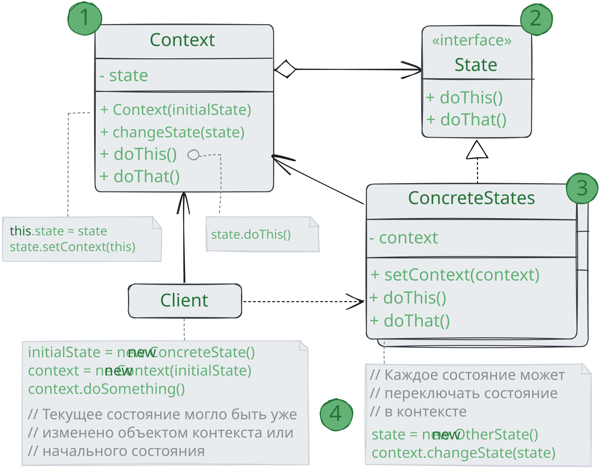

# Состояние

> _Также известен как: State_

**Состояние** - это поведенческий паттерн проектирования,
который позволяет объектам менять поведение в зависимости от своего состояния.
Извне создаётся впечатление, что изменился класс объекта.

### 💔 Проблема

Паттерн Состояние невозможно рассматривать в отрыве от концепции машины состояний,
также известной как _стейт-машина_ или _конечный автомат_.

Основная идея в том, что программа может находиться в одном из нескольких состояний,
которые всё время сменяют друг друга. Набор этих состояний, а также переходов между ними, переопределён и _конечен_.
Находясь в разных состояниях, программа может по-разному реагировать на одни и те же события,
которые происходят с ней.

Такой подход можно применить и к отдельным объектам. Например, объект `Документ` может принимать три состояния:
`Черновик`, `Модерация` или `Опубликован`. В каждом из этих состояний метод `опубликовать` будет работать по-разному:

* Из черновика он отправит объект на модерацию;
* Из модерации - в публикацию, но при условии, что это сделал администратор;
* В опубликованном состоянии метод не будет делать ничего.

Машину состояний чаще всего реализуют с помощью множества условных операторов, `if` либо `switch`,
которые проверяют текущее состояние объекта и выполняют соответствующее поведение.
Наверняка вы уже реализовывали хотя бы одну машину состояний в своей жизни, даже не зная об этом.

Основная проблема такой машины состояний проявится в том случае, если в `Документ` добавить ещё десяток состояний.
Каждый метод будет состоять из увесистого условного оператора, перебирающего доступные состояния.
Такой код крайне сложно поддерживать.
Малейшее изменение логики переходов заставит вас перепроверять работу всех методов,
которые содержат условные операторы машины состояний.

Путаница и нагромождение условий особенно сильно проявляется в старых проектах.
Набор возможных состояний бывает трудно предопределить заранее,
поэтому они всё время добавляются в процессе эволюции программы.
Из-за этого решение, которое выглядело простым и эффективным в самом начале разработки,
может впоследствии стать проекцией большого макаронного монстра.

### 💚 Решение

Паттерн Состояние предлагает создать отдельные классы для каждого состояния, в котором может пребывать объект,
а затем вынести туда поведение, соответствующее этим состояниям.

Вместо того, чтобы хранить код всех состояний, первоначальный объект, называемый _контекстом_,
будет содержать ссылку на один из объектов-состояний и делегировать ему работу, зависящую от состояния.

Благодаря тому, что объекты состояний будут иметь общий интерфейс, контекст сможет делегировать работу состоянию,
не привязываясь к его классу. Поведение контекста можно будет изменить в любой момент,
подключив к нему другой объект-состояние.

Очень важным нюансом, отличающим этот паттерн от **Стратегии**, является то, что и контекст,
и сами конкретные состояния могут знать друг о друге и инициализировать переходы от одного состояния к другому.

### Аналогия из жизни

Ваш смартфон ведёт себя по-разному, в зависимости от текущего состояния:

* Когда телефон разблокирован, нажатие кнопок телефона приводит к каким-то действиям;
* Когда телефон заблокирован, нажатие кнопок приводит к экрану разблокировки;
* Когда телефон разряжен, нажатие кнопок приводит к экрану зарядки.

## Структура

1. **Контекст** хранит ссылку на объект состояния и делегирует ему часть работы, зависящей от состояний.
Контекст работает с этим объектом через общий интерфейс состояний.
Контекст должен иметь метод для присваивания нового объекта-состояния;
2. **Состояние** описывает общий интерфейс для всех конкретных состояний;
3. **Конкретные состояния** реализуют поведения, связанные с определённым состоянием контекста.
Иногда приходится создавать целые иерархии классов состояний, чтобы обобщить дублирующий код. 
Состояние может иметь обратную ссылку на объект контекста.
Через неё не только удобно получать из контекста нужную информацию, но и осуществлять смен его состояния;
4. И контекст, и объект конкретных состояний могут решать когда и какое следующее состояние будет выбрано.
Чтобы переключить состояние, нужно подать другой объект-состояние в контекст.

## Применимость

🪲 **Когда у вас есть объект, поведение которого кардинально меняется в зависимости от внутреннего состояния,
причём типов состояний много, и их код часто меняется.**

_Паттерн предлагает выделить в собственные классы все поля и методы, связанные с определёнными состояниями.
Первоначальный объект будет постоянно ссылаться на один из объектов-состояния, делегируя ему часть своей работы.
Для изменения состояния в контексте достаточно будет подставить другой объект-состояние._

🪲 **Когда код класса содержит множество больших, похожих друг на друга, условных операторов,
которые выбирают поведения в зависимости от текущих значений полей класса.**

_Паттерн предлагает переместить каждую ветку такого условного оператора в собственный класс.
Тут же можно поселить и все поля, связанные с данным состоянием._

🪲 **Когда вы сознательно используете табличную машину состояний, построенную на условных операторах,
но вынуждены мириться с дублированием кода для похожих состояний и переходов.**

_Паттерн Состояние позволяет реализовать иерархическую машину состояний, базирующуюся на наследовании.
Вы можете отнаследовать похожие состояния от одного родительского класса и вынести туда весь дублирующийся код._

## Шаги реализации

1. Определитесь с классом, который будет играть роль контекста. Это может быть как существующий класс,
в котором уже есть зависимость от состояния, так и новый класс, если код состояний размазан по нескольким классам;
2. Создайте общий интерфейс состояний. Он должен описывать методы, общие для всех состояний, обнаруженных в контексте.
Заметьте, что не всё поведение контекста нужно переносить в состояние, а только то, которое зависит от состояний;
3. Для каждого фактического состояния создайте класс, реализующий интерфейс состояния.
Переместите код, связанный с конкретными состояниями в нужные классы.
В конце концов, все методы интерфейса состояния должны быть реализованы во всех классах состояний.
При переносе поведения из контекста вы можете столкнуться с тем,
что это поведение зависит от приватных полей или методов контекста, к которым нет доступа из объекта состояния.
Существует парочка способов обойти эту проблему.
Самый простой - оставить поведение внутри контекста, вызывая его из объекта состояния.
С другой стороны, вы можете сделать классы состояний вложенными в класс контекста, 
и тогда они получат доступ ко всем приватным частям контекста. 
Но последний способ доступен только в некоторых языках программирования (например, Java, C#);
4. Создайте в контексте поле для хранения объектов-состояний, а также публичный метод для изменения значения этого поля;
5. Старые методы контекста, в которых находился зависимый от состояния код,
замените на вызовы соответствующих методов объекта-состояния;
6. В зависимости от бизнес-логики, разместите код, который переключает состояние контекста либо внутри контекста,
либо внутри классов конкретных состояний.

## Преимущества и недостатки

* ✅ Избавляет от множества больших условных операторов машины состояний;
* ✅ Концентрирует в одном месте код, связанный с определённым состоянием;
* ✅ Упрощает код контекста;
* ❌ Можно неоправданно усложнить код, если состояний мало и они редко меняются.

## Отношения с другими паттернами

* Мост, Стратегия и Состояние (а также слегка и Адаптер) имеют схожие структуры классов - все они построены
  на принципе «композиции», то есть делегирования работы другим объектам.
  Тем не менее, они отличаются тем, что решают разные проблемы.
  Помните, что паттерны - это не только рецепт построения кода определённым образом,
  но и описание проблем, которые привели к данному решению;
* **Состояние** можно рассматривать как надстройку над **Стратегией**. 
Оба паттерна используют композицию, чтобы менять поведение основного объекта,
делегируя работу вложенным объектам-помощникам.
Однако в _Стратегии_ эти объекты не знают друг о друге и никак не связаны.
В _Состоянии_ сами конкретные состояния могут переключать контекст.