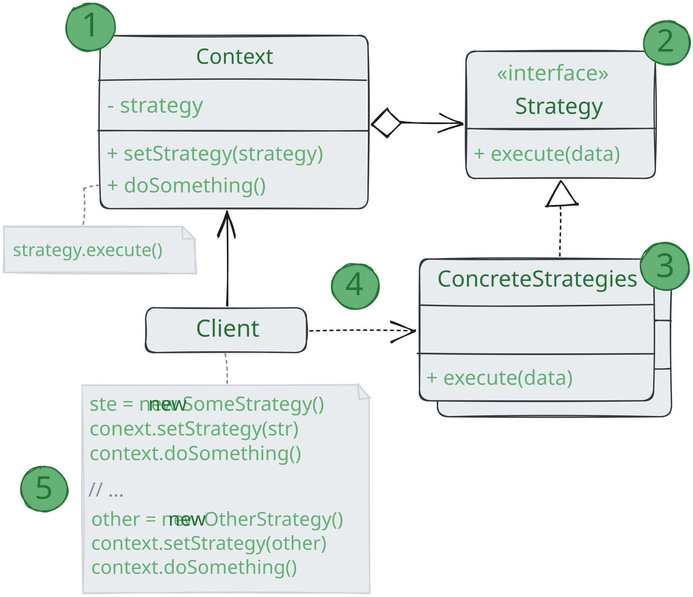

# Стратегия

> _Также известен как: Strategy_

**Стратегия** - это поведенческий паттерн проектирования,
который определяет семейство схожих алгоритмов и помещает каждый из них в собственный класс,
после чего алгоритмы можно взаимозаменять прямо во время исполнения программы.

### 💔 Проблема

Вы решили написать приложение-навигатор для путешественников. Оно должно показывать красивую и удобную карту,
позволяющую с лёгкостью ориентироваться в незнакомом городе.

Одной из самых востребованных функций являлся поиск и прокладывание маршрутов.
Пребывая в неизвестном ему городе, пользователь должен иметь возможность указать начальную точку и пункт назначения,
а навигатор - проложить оптимальный путь.

Первая версия вашего навигатора могла прокладывать маршрут по дорогам,
поэтому отлично подходила для путешествий на автомобиле. Но, очевидно, не все ездят в отпуск на машине.
Поэтому следующим шагом вы добавили в навигатор прокладывание пеших маршрутов.

Через некоторое время выяснилось, что некоторые люди предпочитают ездить по городу на общественном транспорте.
Поэтому вы добавили и такую опцию прокладывания пути.

Но и это ещё не все. В ближайшей перспективе вы хотели бы добавить прокладывание маршрутов по велодорожкам.
А в отдалённом будущем - интересные маршруты посещения достопримечательностей.

Если с популярностью навигатора не было никаких проблем,
то техническая часть вызывала вопросы и периодическую головную боль.
С каждым новым алгоритмом код основного класса навигатора увеличивался вдвое.
В таком большом классе стало довольно трудно ориентироваться.

Любое изменение алгоритмов поиска,
будь то исправление багов или добавление нового алгоритма, затрагивало основной класс.
Это повышало риск сделать ошибку, случайно задев остальной работающий код.

Кроме того, осложнялась командная работа с другими программистами,
которых вы наняли после успешного релиза навигатора. Ваши изменения нередко затрагивали один и тот же код,
создавая конфликты, которые требовали дополнительного времени на из разрешение.

### 💚 Решение

Паттерн Стратегия предлагает определить семейство схожих алгоритмов, которые часто изменяются или расширяются,
и вынести их в собственные классы, называемые стратегиями.

Вместо того, чтобы изначальный класс сам выполнял тот или иной алгоритм, он будет играть роль контекста,
ссылаясь на одну из стратегий и делегируя её выполнение работы. Чтобы сменить алгоритм,
вам будет достаточно подставить в контекст другой объект-стратегию.

Важно, чтобы все стратегии имели общий интерфейс.
Используя этот интерфейс, контекст программы независимым от конкретных классов стратегий. С другой стороны,
вы сможете изменять и добавлять новые виды алгоритмов, не трогая код контекста.

В нашем примере каждый алгоритм поиска пути переедет в свой собственный класс.
В этих классах будет определён лишь один метод, принимающий в параметрах координаты начала и конца пути,
а возвращать массив точек маршрута.

Хотя каждый класс будет прокладывать маршрут по-своему, для навигатора это не будет иметь никакого значения,
так как его работа заключается только в отрисовке маршрута.
Навигатору достаточно подать стратегии данные о начале и конце маршрута,
чтобы получить массив точек маршрута в оговорённом формате. Класс навигатора будет иметь метод для установки стратегии,
позволяя изменять стратегию поиска пути на лету. Такой метод пригодится клиентскому коду навигатора, например,
переключателям типов маршрутов в пользовательском интерфейсе.

### Аналогия из жизни

Вам нужно добраться до аэропорта. Можно доехать на автобусе, такси или велосипеде.
Здесь вид транспорта является стратегией.
Вы выбираете конкретную стратегию в зависимости от контекста - наличия денег или времени до отлёта.

## Структура

1. **Контекст** хранит ссылку на объект конкретной стратегии, работая с ним через общий интерфейс стратегии;
2. **Стратегия** определяет интерфейс, общий для всех вариаций алгоритма. Контекст использует этот интерфейс для вызова.
Для контекста неважно, какая именно вариация алгоритма будет выбрана, так как все они имеют одинаковый интерфейс;
3. **Конкретный стратегии** реализуют различные вариации алгоритма;
4. Во время выполнения программы контекст получает вызовы от клиента и делегирует их объекту конкретной стратегии;
5. Клиент должен создать объект конкретной стратегии и передать его в конструктор контекста.
Кроме этого, клиент должен иметь возможность заменить стратегию на лету, используя сеттер.
Благодаря этому, контекст не будет знать о том, какая именно стратегия сейчас выбрана.

## Применимость

🪲 **Когда вам нужно использовать разные вариации какого-то алгоритма внутри одного объекта.**

_Стратегия позволяет варьировать поведение объекта во время выполнения программы,
подставляя в него различные объекты-повделения (например, отличающиеся балансом скорости и потребления ресурсов)._

🪲 **Когда у вас есть множество похожих классов, отличающихся только некоторым поведением.**

_Стратегия позволяет вынести отличающееся поведение в отдельную иерархию классов,
а затем свести первоначальные классы к одному, сделав поведение этого класса настраиваемым._

🪲 **Когда вы не хотите обнажать детали реализации алгоритмов для других классов.**

_Стратегия позволят изолировать код, данные и зависимости алгоритмов от других объектов,
скрыв детали внутри классов-стратегий._

🪲 **Когда различные вариации алгоритмов реализованы в виде развесистого условного оператора.
Каждая ветка такого оператора представляет собой вариацию алгоритма.**

_Стратегия помещает каждую лапу такого оператора в отдельный класс-стратегию.
Затем контекст получает определённый объект-стратегию от клиента и делегирует ему работу.
Если друг понадобится сменить алгоритм, в контекст можно подать другую стратегию._

## Шаги реализации

1. Определите алгоритм, который подвержен частым изменениям. Также подойдет алгоритм, имеющий несколько вариаций,
которые выбираются во время выполнения программы;
2. Создайте интерфейс стратегии, описывающий этот алгоритм. Он должен быть общим для всех вариантов алгоритма;
3. Поместите вариации алгоритма в собственные классы, которые реализуют этот интерфейс;
4. В классе контекста создайте поле для хранения ссылки на текущий объект-стратегию, а также метод для её изменения.
Убедитесь в том, что контекст работает с этим объектом только через общий интерфейс стратегий;
5. Клиенты контекста должно подавать в него соответствующий объект-стратегию, когда хотят,
чтобы контекст вёл себя определённы образом.

## Преимущества и недостатки

* ✅ Горячая замена алгоритмов на лету;
* ✅ Изолирует код и данные алгоритмов от остальных классов;
* ✅ Уход о наследования к делегированию;
* ✅ Реализовывает принцип _открытости/закрытости_;
* ❌ Усложняет программу за счёт дополнительных классов;
* ❌ Клиент должен знать, в чём состоит разница между стратегиями, чтобы выбрать подходящую.

## Отношения с другими паттернами

* Мост, Стратегия и Состояние (а также слегка и Адаптер) имеют схожие структуры классов - все они построены
  на принципе «композиции», то есть делегирования работы другим объектам.
  Тем не менее, они отличаются тем, что решают разные проблемы.
  Помните, что паттерны - это не только рецепт построения кода определённым образом,
  но и описание проблем, которые привели к данному решению;
* **Команда** и **Стратегия** похожи по духу, но отличаются масштабом и применением:
    * _Команду_ используют, чтобы превратить любые разнородные действия в объекты.
      Параметры операции превращаются в поля объекта. Этот объект теперь можно логировать, хранить в истории для отмены,
      передавать во внешние сервисы и так далее;
    * С другой стороны, _Стратегия_ описывает разные способы произвести одни и то же действие,
      позволяя взаимозаменять эти способы в каком-то объекте контекста.
* **Стратегия** меняет поведение объекта «изнутри», а **Декоратор** изменяет его «снаружи»;
* **Шаблонный метод** использует наследование, чтобы расширять часть алгоритма. 
**Стратегия** использует делегирование, чтобы изменять выполняемые алгоритмы на лету.
_Шаблонный метод_ работает на уровне классов. _Стратегия_ позволяет менять логику отдельных объектов;
* **Состояние** можно рассматривать как надстройку над **Стратегией**.
  Оба паттерна используют композицию, чтобы менять поведение основного объекта,
  делегируя работу вложенным объектам-помощникам.
  Однако в _Стратегии_ эти объекты не знают друг о друге и никак не связаны.
  В _Состоянии_ сами конкретные состояния могут переключать контекст.