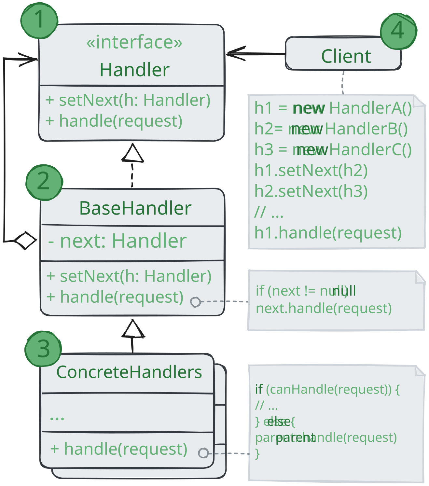

# Цепочка обязанностей

> Также известен как: CoR, Chain of Responsibility

**Цепочка обязанностей** - это поведенческий паттерн проектирования, который позволяет передавать запросы
последовательно по цепочке обработчиков. Каждый последующий обработчик решает, может ли он обработать
запрос сам и стоит ли передавать запрос дальше по цепи.

### 💔 Проблема

Представьте, что вы делаете систему приёма онлайн-заказов. Вы хотите ограничить к ней доступ так,
чтобы только авторизованные пользователи могли создавать заказы. Кроме того, определённые пользователи,
владеющие правами администратора, должны иметь полный доступ к заказам.

Вы быстро сообразили, что эти проверки нужно выполнять последовательно.
Ведь пользователя можно попытаться «залогинить» в систему, если его запрос содержит логин и пароль.
Но если такая попытка не удалась, то проверять расширенные права доступа не имеет смысла.

На протяжении следующих нескольких месяцев вам пришлось бы добавить ещё несколько таких последовательных проверок.

* Кто-то резонно заметил, что неплохо бы проверять данные, передаваемые в запросе перед тем, 
как вносить их в систему - вдруг запрос содержит данные о покупке несуществующих продуктов;
* Кто-то предложил блокировать массовые отправки формы с одним и тем же логином,
чтобы предотвратить подбор паролей ботами;
* Кто-то заметил, что форму заказа неплохо бы доставать из кеша, если она уже была однажды показана.

С каждой новой «фичей» код проверок, выглядящий как большой клубок условных операторов, всё больше и больше раздувался.
При изменении одного правила приходилось трогать код всех проверок.
А для того, чтобы применить проверки к другим ресурсам, пришлось продублировать их код в других классах.

Поддерживать такой код стало не только очень хлопотно, но и затратно.
И вот в один прекрасный день вы получаете задачу рефакторинга...

### 💚 Решение

Как и многие другие поведенческие паттерны, Цепочка обязанностей базируется на том,
чтобы превратить отдельные поведения в объекты.
В нашем случае каждая проверка переедет в отдельный класс с единственным методом выполнения.
Данные запроса, над которым происходит проверка, будут передаваться в метод как аргументы.

А теперь по-настоящему важный этап. Паттерн предлагает связать объекты обработчиков в одну цепь.
Каждый из них будет иметь ссылку на следующий обработчик в цепи. Таким образом,
при получении запроса обработчик сможет не только сам что-то с ним сделать,
но и передать обработку следующему объекту в цепочке.

Передавая запрос в первый обработчик цепочки, вы можете быть уверены,
что все объекты в цепи смогут его обработать.
При этом длина цепочки не имеет никакого значения.

И последний штрих. Обработчик не обязательно должен передавать запрос дальше,
причём эта особенность может быть использована по-разному.

В примере с фильтрацией доступа обработчики прерывают дальнейшие проверки,
если текущая проверка не прошла. Ведь нет смысла тратить попусту ресурсы, если и так понятно,
что с запросом что-то не так.

Но есть и другой подход, при котором обработчики прерывают цепь только тогда когда они _могут_ обработать запрос.
В этом случае запрос движется по цепи, пока не найдётся обработчик, который может его обработать.
Очень часто такой подход используется для передачи событий,
создаваемых классами графического интерфейса в результате взаимодействия с пользователем.

Например, когда пользователь кликает по кнопке, программа выстраивает цепочку из объекта этой кнопки,
всех её родительских элементов и общего окна на конце. Событие клика передаётся по этой цепи до тех пор,
пока не найдётся объект, способный его обработать. Этот пример примечателен ещё и тем, что цепочку всегда можно
выделить из древовидной структуры объектов, в которую обычно и свёрнуты элементы пользовательского интерфейса.

Очень важно, чтобы все объекты цепочки имели общий интерфейс.
Обычно каждому конкретному обработчику достаточно знать только то,
что следующий объект в цепи имеет метод `выполнить`. Благодаря этому связи между объектами цепочки будут более гибкими.
Кроме того, вы сможете формировать цепочки на лету из разнообразных объектов, не привязываясь к конкретным классам.

### Аналогия из жизни

Вы купили новую видеокарту. Она автоматически определилась и заработала под Window, но в вашей любимой Ubuntu «завести»
её не удалось. Со слабой надеждой вы звоните в службу поддержки.

Первым вы слышите голос автоответчика, предлагающий выбор из десятка стандартных решений.
Ни один из вариантов не подходит, и робот соединяет вас с живым оператором.

Увы, но рядовой оператор поддержки умеет общаться только заученными фразами и давать шаблонные ответы.
После очередного предложения «выключить и включить компьютер» вы просите связать вас с настоящими инженерами.

Оператор перебрасывает звонок дежурном инженеру, изнывающему от скуки в своей каморке.
Уж он то знает, как вам помочь! Инженер рассказывает вам, где скачать подходящие драйвера и как настроить их под Ubuntu.
Запрос удовлетворён. Вы кладёте трубку.

## Структура

1. **Обработчик** определяет общий для всех конкретных обработчиков интерфейс.
Обычно достаточно описать единственный метод обработки запросов,
но иногда может быть объявлен и метод выставления следующего обработчика;
2. **Базовый обработчик** - операционный класс,
который позволяет избавиться от дублирования одного и того же кода во всех конкретных обработчиках;
Обычно этот класс имеет поле для хранения ссылки на следующий обработчик в цепочке.
Клиент связывает обработчики в цепь, подавая ссылку на следующий обработчик через конструктор или сеттер поля.
Также здесь можно реализовать базовый метод обработки,
который бы просто перенаправлял запрос следующему обработчику, проверив его наличие;
3. **Конкретные обработчики** содержат код обработки запросов.
При получении запроса каждый обработчик решает, может ли он обработать запрос,
а также стоит ли передать его следующему объекту;
В большинстве случаев обработчики могут работать сами по себе и быть неизменяемыми,
получив все нужные детали через параметры конструктора;
4. **Клиент** может либо сформировать цепочку обработчиков единожды,
либо перестраивать её динамически, в зависимости от логики программы.
Клиент может отправлять запросы любому из объектов цепочки, не обязательно первому из них.

## Применимость

🪲 **Когда программа должна обрабатывать разнообразные запросы несколькими способами, но заранее неизвестно,
какие конкретно запросы будут приходить и какие обработчики для них понадобятся.**

_С помощью Цепочки обязанностей вы можете связать потенциальных обработчиков в одну цепь и при получении
запроса поочерёдно спрашивают каждого из них, не хочет ли он обработать запрос._

🪲 **Когда важно, чтобы обработчики выполнялись один за другим в строгом порядке.**

_Цепочка обязанностей позволяет запускать обработчиков
последовательно один за другим в том порядке, в котором они находятся в цепочке._

🪲 **Когда набор объектов, способных обработать запрос, должен задаваться динамически.**

_В любой момент вы можете вмешаться в существующую цепочку и переназначить связи так,
чтобы убрать или добавить новое звено._

## Шаги реализации

1. Создайте интерфейс обработчика и опишите в нём основной метод обработки;
Продумайте, в каком виде клиент должен передавать данные запроса в обработчик.
Самый гибкий способ - превратить данные запроса в объект и передавать его целиком через параметры метода обработчик;
2. Имеет смысл создать абстрактный базовый класс обработчиков,
чтобы не дублировать реализацию метода получения следующего обработчика во всех конкретных обработчиках.
Добавьте в базовый обработчик поле для хранения ссылки на следующий объект цепочки.
Устанавливайте начальное значение этого поля через конструктор. Это сделает объекты обработчиков неизменяемыми. 
Но если программа предполагает динамическую перестройку цепочек, можете добавить и сеттер для поля.
Реализуйте базовый метод обработки так, чтобы он перенаправлял запрос следующему объекту, проверив его наличие.
Это позволит полностью скрыть поле-ссылку от подклассов, дав им возможность передавать запросы дальше по цепи,
обращаясь к родительской реализации метода;
3. Один за другим создайте класс конкретных обработчиков и реализуйте в них методы обработки запросов.
При получении запроса каждый обработчик должен решить:
   * Может ли он обработать запрос или нет?
   * Следует ли передать запрос следующему объекту или нет?
4. Клиент может собирать цепочку обработчиков самостоятельно, опираясь на свою бизнес-логику,
либо получать уже готовые цепочки извне. В последнем случае цепочки собираются фабричными объектам,
опираясь на конфигурацию приложения или параметры окружения;
5. Клиент должен знать о динамической природе цепочки и быть готов к таким случаям:
   * Цепочка может состоять из единственного объекта;
   * Запросы могут не достигать конца цепи;
   * Запросы могут достигать конца, оставаясь необработанными.

## Преимущества и недостатки

* ✅ Уменьшает зависимость между клиентом и обработчиками;
* ✅ Реализует принцип _единственной обязанности_;
* ✅ Реализует принцип _открытости/закрытости_;
* ❌ Запрос может остаться никем не обработанным.

## Отношения с другими паттернами

* **Цепочка обязанностей**, **Команда**, **Посредник** и **Наблюдатель** показывают 
различные способы работы отправителей запросов с их получателями:
  * _Цепочка обязанностей_ передаёт запрос последовательно через цепочку потенциальных получателей,
  ожидая, что какой-то из них обработает запрос;
  * _Команда_ устанавливает косвенную одностороннюю связь от отправителей к получателям;
  * _Посредник_ убирает прямую связь между отправителями и получателями,
  заставляя их общаться опосредованно, через себя;
  * _Наблюдатель_ передаёт запрос одновременно всем заинтересованным получателям,
  но позволяет им динамически подписываться или отписываться от таких оповещений.
* **Цепочку обязанностей** часто используют вместе с **Компоновщиком**. 
В этом случае запрос передаётся от дочерних компонентов к их родителям;
* Обработчики в **Цепочке обязанностей** могу быть выполнены в виде **Команды**.
В этом случае множеств разных операций может быть выполнено над одним и тем же контекстом, коим является запрос.
Но есть и другой подход, в котором сам запрос является _Командой_, посланной по цепочке объектов.
В этом случае ода и та же операция может быть выполнена над множеством разных контекстов, представленных в виде цепочки;
* **Цепочка обязанностей** и **Декоратор** имеют очень похожие структуры. Оба паттерна базируются на принципе
рекурсивного выполнения операции через серию связанных объектов. Но есть и несколько важных отличий.
Обработчики в Цепочке обязанностей могут выполнять произвольные действия, независимые друг от друга,
а также в любой момент прерывать дальнейшую передачу по цепочке.
С другой стороны _Декораторы_ расширяют какое-то определённое действие,
не ломая интерфейс базовой операции и не прерывая выполнение остальных декораторов. 