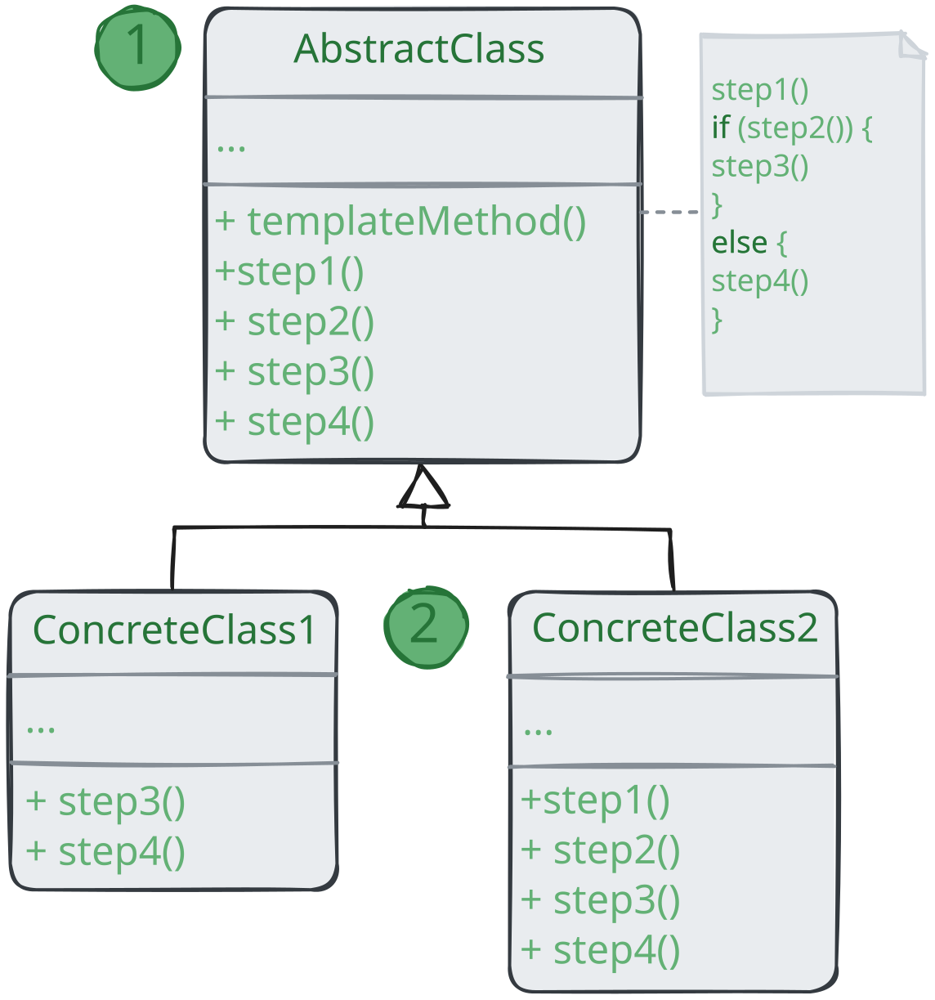

# Шаблонный метод

> _Также известен как: Template Method_

**Шаблонный метод** - это поведенческий паттерн проектирования, который определяет скелет алгоритма,
перекладывая ответственность за некоторые его шаги на подклассы.
Паттерн позволяет подклассам переопределять шаги алгоритма, не меняя его общей структуры.

### 💔 Проблема

Вы пишите программу для дата-майнинга в офисных документах.
Пользователи будут загружать в неё документы в разных форматах (PDF, DOC, CSV),
а программа должна извлекать из них полезную информацию.

В первой версии вы ограничились только обработкой DOC-файлов. В следующей версии добавили поддержку CSV.
А через месяц прикрутили работу с PDF-документами.

В какой-то момент вы заметили,
что код всех трёх классов обработки документов хоть и отличается в части работы с файлами,
но содержит довольно много общего в части самого извлечения данных.
Было бы здорово избавиться от повторной реализации алгоритма извлечения данных в каждом из классов.

К томе же остальной код, работающий с объектами этих классов, наполнен условиями,
проверяющими тип обработчика перед началом работы. Весь этот код можно упростить,
если три класса воедино либо свести их к общему интерфейсу.

### 💚 Решение

Паттерн _Шаблонный метод_ предлагает разбить алгоритм на последовательность шагов,
описать эти шаги в отдельных методах и вызывать из в одном шаблонном методе друг за другом.

Это позволит подклассам переопределять некоторые шаги алгоритма,
оставляя без изменений его структуру и остальные шаги, которые для этого подкласса не так важны.

В нашем примере с дата-майнингом мы можем создать общий класс для всех трёх алгоритмов.
Этот класс будет состоять из шаблонного метода, который последовательно вызывает шаги разбора документов.

Для начала шаги шаблонного метода можно сделать абстрактными.
Из-за этого все подклассы должнгы буудт релаизовать каждый из шагов по-своему.
В нашем случае все подклассы и так содержат реализацию каждого из шагов, поэтому ничего дополнително делать не нужно.

По-настоящему важным является следующий этап.
Теперь мы можем определить общее для всех классов поведение и вынести его в суперкласс.
В нашем примере шаги открытия, считывания и закрытия могут отличаться для разных типов документов,
поэтому останутся абстрактным.
А вот одинаковый для всех типов документов код обработки данных переедет в базовый класс.

Как видите, нас получилось два вида шагов: _абстрактные_, которые каждый подкласс обязательно должен реализовать,
а также шаги с реализацией по умолчанию, которые можно переопределять в подклассах, но не обязательно.

Но есть и третий тип шагов - хуки:
их необязательно переопределять, но они содержат никакого кода, выглядя как обычные методы.
Шаблонный метод останется рабочим, даже если ни один подкласс не переопределит такой хук.
Однако, хук даёт подклассам дополнительные точки «вклинивания» в шаблонный метод. 

### Аналогия из жизни

Строители используют подход, похожий на шаблонный метод при строительстве типов домов.
У них есть основной архитектурный проект, в котором расписаны шаги строительства:
заливка фундамента, постройка стен, перекрытие крыши, установка окон и так далее.

Но, несмотря на стандартизацию каждого этапа, строители могут вносить небольшие изменения на любом из этапов,
чтобы сделать дом чуточку непохожим на другие.

## Структура

1. **Абстрактный класс** определяет шаги алгоритма и содержит шаблонный метод, состоящий из вызовов этих шагов.
Шаги могут быть как абстрактными, так и содержать реализацию по умолчанию;
2. **Конкретный класс** переопределяет некоторые (или все) шаги алгоритма.
Конкретные классы не переопределяют сам шаблонный метод.

## Применимость

🪲 **Когда подклассы должны расширять базовый алгоритм, не меняя его структуры.**

_Шаблонный метод позволяет подклассам расширять определённые шаги алгоритма через наследование,
не меняя при этом структуру алгоритмов, объявленную в базовом классе._

🪲 **Когда у вас есть несколько классов, делающих одно и то же с незначительными отличиями.
Если вы редактируете один класс, то приходится вносить такие же правки и в остальные классы.**

_Паттерн_ Шаблонный метод_ предлагает создать для похожих классов
общий суперкласс и оформить в нём главный алгоритм в виде шагов. Отличающиеся шаги можно переопределить в подклассах.
Это позволит убрать дублирование кода в нескольких классах с похожим поведением, но отличающихся деталях._

##  Шаги реализации

1. Изучите алгоритм и подумайте, можно ли его разбить на шаги. 
Прикиньте, какие шаги будут стандартными для всех вариаций алгоритма, а какие - изменяющимися;
2. Создайте абстрактный базовый класс. Определите в нём шаблонный метод.
Этот метод должен состоять из вызовов шагов алгоритма. Имеет смысл сделать шаблонный метод финальным,
чтобы подклассы не могли переопределить его (если ваш язык программирования это позволяет);
3. Добавьте в абстрактный класс методы для каждого из шагов алгоритм.
Вы можете сделать эти методы абстрактными илл добавить какую-то реализацию по умолчанию. 
В первом случае все подклассы _должны_ будут реализовать эти методы, 
а во втором - только если реализация шага в подклассе отличается от стандартной версии;
4. Подумайте о введении в алгоритм хуков.
Чаще всего, хуки располагаются между основными шагами алгоритма, а также до и после всех шагов;
5. Создайте конкретные классы, унаследовав их от абстрактного класса. Реализуйте в них все недостающие шаги и хуки.

## Преимущества и недостатки

* ✅ Облегчает повторное использование кода;
* ❌ Вы жёстко ограничены скелетом существующего алгоритма;
* ❌ Вы можете нарушить принцип _подстановки Барбары Лисков_,
изменяя базовое поведение одного из шагов алгоритма через подкласс;
* ❌ С ростом количества шагов шаблонный метод становится слишком сложно поддерживать.

## Отношения с другими паттернами

* **Фабричный метод** можно рассматривать как частный случай **Шаблонного метода**.
Кроме того, _Фабричный метод_ нередко бывает частью большого класса с Шаблонными методами;
* **Шаблонный метод** использует наследование, чтобы расширять части алгоритма. **Стратегия** использует делегирование,
чтобы изменять выполняемые алгоритмы на лету. _Шаблонный метод_ работает на уровне класса.
_Стратегия_ меняет логику отдельных объектов.