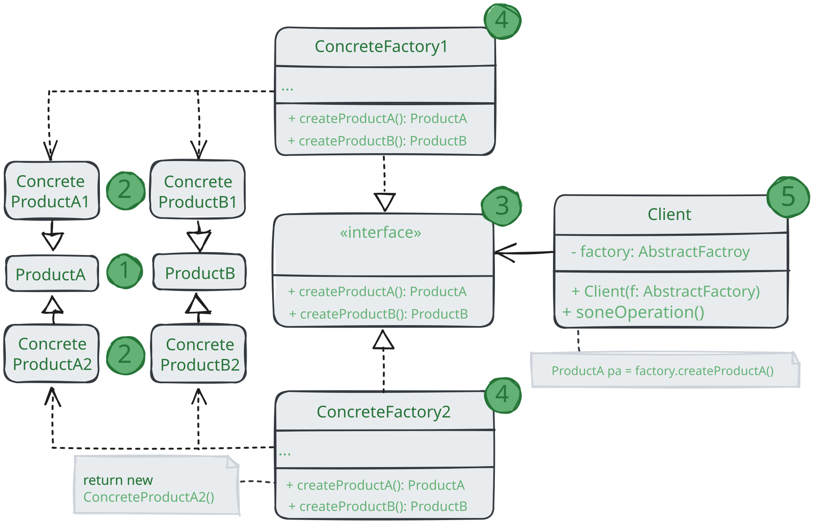

# Абстрактная фабрика

> _Также известен как: Abstract Factory_

**Абстрактная фабрика** - это порождающий паттерн проектирования,
который позволяет создавать семейства связанных объектов, не привязываясь к конкретным классам создаваемых объектов.

### 💔 Проблема

Представьте, что вы пишите симулятор мебельного магазина. Ваш код содержит:

1. Семейства зависимых продуктов. Скажем `Кресло` + `Диван` + `Столик`;
2. Несколько вариаций этого семейства.
Например, продукты `Кресло`, `Диван` и `Столик` представлены в трёх разных стилях:
`Ар-деко`, `Викторианском` и `Модерне`.

Вам нужен такой способ создавать объекты продуктов, чтобы они сочетались с другими продуктами того же семейства.
Это важно, так как клиенты расстраиваются, если получают несочетающуюся мебель.

Кроме того, вы не хотите вносить изменения в существующий код при добавлении новы продуктов или семейств в программу.
Поставщики часто обновляют свои каталоги,
и вы бы не хотели менять уже написанный код каждый раз при получении новых моделей мебели.

### 💚 Решение

Для начала паттерн _Абстрактная фабрика_ предлагает выделить общие интерфейсы
для отдельных продуктов, составляющих семейства.
Так, все вариации кресел получат общий интерфейс `Кресло`, все диваны реализуют интерфейс `Диван` и так далее.

Далее вы создаёте _абстрактную фабрику_ - общий интерфейс, который содержит методы создания всех продуктов семейства
(например, `создатьКресло`, `создатьДиван` и `создатьСтолик`).
Эти операции должны возвращать **абстрактный** типы продуктов, представленные интерфейсами,
которые мы выделили ранее - `Кресла`, `Диваны` и `Столики`.

Как насчёт вариации продуктов? Для каждой вариации семейства продуктов мы должны создать свою собственную фабрику,
реализовав абстрактный интерфейс. Фабрики создают продукты одной вариации.
Например, `ФабрикаМодерн` будет возвращать только `КреслаМодерн`, `ДиваныМодерн` и `СтоликМодерн`.

Клиентский код должен работать как с фабриками, так и с продуктами только через их общие интерфейсы. 
Это позволит подавать в ваши классы любой тип фабрики и производить любые продукты, ничего не ломая.

Например, клиентский код просит фабрику сделать стул. Он не знает, какого типа была эта фабрика.
Он не знает, получит викторианский или модерновый стул. Для него важно,
чтобы на стуле можно было сидеть и чтобы этот стул отлично смотрелся с диваном той же фабрики.

Осталось прояснить последний момент: кто создаёт объекты конкретных фабрик,
если клиентский код работает только с интерфейсами фабрик?
Обычно программа создаёт конкретный объект фабрики при запуске,
причём тип фабрики выбирается, исходя из параметров окружения или конфигурации.

## Структура

1. **Абстрактные продукты** объявляют интерфейсы продуктов,
которые связаны друг с другом по смыслу, но выполняют разные функции;
2. **Конкретные продукты** - большой набор классов, которые относятся к различным абстрактным продуктам 
(кресло/столик), но имеют одни и те же вариации (Викторианский/Модерн);
3. **Абстрактная фабрика** объявляет методы создания различных абстрактных продуктов (кресло/столик);
4. **Конкретные фабрики** относятся каждая к своей вариации продуктов
(Викторианская/Модерн) и реализуют методы абстрактной фабрики, позволяя создавать все продукты определённой вариации;
5. Несмотря на то, что конкретные фабрики порождают конкретные продукты,
сигнатуры их методов должны возвращать соответствующие абстрактные продукты.
Это позволит клиентском коду, использующему фабрику, не привязываться к конкретным классам продуктов.
Клиент сможет работать с любыми вариациями продуктов через абстрактные интерфейсы.

## Применимость

🪲 **Когда бизнес-логика программы должна работать с разным видами связанных друг с другом продуктов,
не завися от конкретных классов продуктов.**

_Абстрактная фабрика скрывает от клиентского кода подробности того, как и какие конкретно объекты будут созданы.
Но при этом клиентский код может работать со всеми типами создаваемых продуктов,
поскольку их общий интерфейс был заранее определён._

🪲 **Когда в программе уже используется _Фабричный метод_,
но очередные изменения предполагают введение новых типов продуктов.**

_В хорошей программе каждый_ класс отвечает только за одну вещь_.
Если класс имеет слишком много фабричных методов, они способны затуманить его основную функцию.
Поэтому имеет смысл внести всю логику создания продуктов в отдельную иерархию классов, применив абстрактную фабрику._

## Шаги реализации

1. Создайте таблицу соотношений типов продуктов к вариациям семейств продуктов;
2. Сведите все вариации продуктов к общим интерфейсам;
3. Определите интерфейс абстрактной фабрики. Он должен иметь фабричные методы для создания каждого из типов продуктов;
4. Создайте класс конкретных фабрик, реализовав интерфейс абстрактной фабрики. 
Этих классов должно быть столько же, сколько и вариаций семейств продуктов;
5. Измените код инициализации программы так, чтобы она создавала определённую фабрику и передавала её в клиентский код;
6. Замените в клиентском коде участки создания продуктов через конструктор вызовами соответствующих методов фабрики.

## Преимущества и недостатки

* ✅ Гарантирует сочетаемость создаваемых продуктов;
* ✅ Избавляет клиентский код от привязки к конкретным классам продуктов;
* ✅ Выделяет код производства продуктов в одно место, упрощая поддержку кода;
* ✅ Упрощает добавление новых продуктов в программу; 
* ✅ Реализует _принцип открытости/закрытости_;
* ❌ Усложняет код программы из-за введения множества дополнительных классов;
* ❌ Требует наличия всех типов продуктов в каждой вариации.

## Отношения с другими паттернами

* Многие архитектуры начинаются с применения **Фабричного метода**
  (более простого и расширяемого через подклассы) и эволюционирует в сторону **Абстрактной фабрики**,
  **Прототипа** или **Стратегии** (более гибких, но и более сложных);
* **Строитель** концентрируется на построении сложных объектов шаг за шагом.
**Абстрактная фабрика** специализируется на создании семейств связанный продуктов.
_Строитель_ возвращает продукт только после выполнения всех шагов, а _Абстрактная фабрика_ возвращает продукт сразу же;
* Классы **Абстрактной фабрики** чаще всего реализуются с помощью **Фабричного метода**,
  хотя они могут быть построены и на основе **Прототипа**;
* **Абстрактная фабрика** может быть использована вместо _Фасада_ для того, чтобы скрыть платформо-зависимые классы;
* **Абстрактная фабрика** может работать совместно с **Мостом**. Это особенно полезно, если у вас есть абстракции,
которые могут работать только с некоторыми из реализаций.
В этом случае фабрика будет определять типы создаваемых абстракций и реализаций;
* **Абстрактная фабрика**, **Строитель** и **Прототип** могут быть реализованы при помощи **Одиночки**.