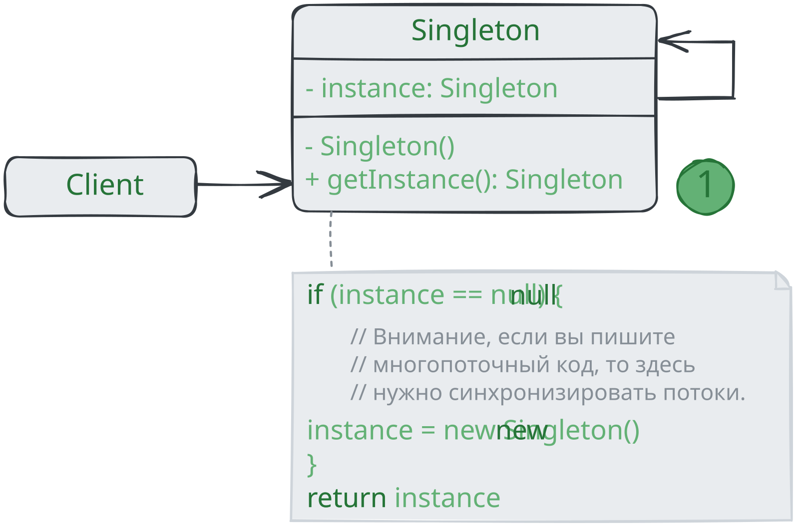

# Одиночка

> _Также известен как: Singleton_

**Одиночка** - это порождающий паттерн проектирования, который гарантирует,
что у класса есть только один экземпляр, и предоставляет к нему глобальную точку доступа.

### 💔 Проблема

Одиночка решает сразу две проблемы, нарушая _принцип единственной ответственности_ класса.

1. **Гарантирует наличие единственного экземпляра класса.**
Чаще всего это полезно для доступа к какому-то общему ресурсу, например, базу данных.
Представьте, что вы создали объект, а через некоторое время пробуете создать ещё один.
В этом случае хотелось бы получить старый объект, вместо создания нового.
Такое поведение невозможно реализовать с помощью обычного конструктора,
так как конструктор класса **всегда** возвращает новый объект.
2. **Предоставляет глобальную точку доступа.**
Это не просто глобальная переменная, через которую можно достучаться к определённому объекту.
Глобальные переменные не защищены от записи, поэтому любой код может подменять их значение без вашего ведома.
Но есть и другой нюанс. Неплохо бы хранить в одном месте и код, который решает проблему №1,
а также имеет к нему простой и доступный интерфейс.
Интересно, что в наше время паттерн стал настолько известен, что теперь люди называют «одиночками» даже те классы,
которые решают лишь одну из проблем, перечисленных выше.

### 💚 Решение

Все реализации одиночки сводятся к тому, чтобы скрыть конструктор по умолчанию и создать публичный статический метод,
который и будет контролировать жизненный цикл объекта-одиночки.

Если у вас есть доступ к классу одиночки, значит, будет доступ и к этому статическому методу.
Из какой точки кода вы бы его ни вызвали, он всегда будет отдавать один и тот же объект.

### Аналогия из жизни

Правительство государства - хороший пример одиночки. В государстве может быть только одно официальное правительство.
Вне зависимости от того, кто конкретно заседает в правительстве,
оно имеет глобальную точку доступа «Правительство страны N».

## Структура

1. **Одиночка** определяет статический метод `getInstance`, который возвращает единственный экземпляр своего класса.
Конструктор одиночки должен быть скрыт от клиентов.
Вызов метод `getInstance` должен стать единственным способом получить объект этого класса.

## Применимость

🪲 **Когда в программе должен быть единственный экземпляр какого-то класса, доступный всем клиентам
(например, общий доступ к базе данных из разных частей программы).**

_Одиночка скрывает от клиента все способы создания нового объекта, кроме специального метода.
Этот метод либо создаёт объект, либо отдаёт существующий объект, если он уже был создан._

🪲 **Когда вам хочется иметь больше контроля над глобальными переменными.**

_В отличие от глобальных переменных, Одиночка гарантирует, что никакой другой код не заменит созданный экземпляр класса,
поэтому вы всегда уверены в наличии лишь одного объекта-одиночки. Тем не менее, в любой момент вы можете расширить это 
ограничение и позволить любое количество объектов-одиночек, поменяв код в одном месте (метод `getInstance`)._

## Шаги реализации

1. Добавьте в класс приватное статическое поле, которое будет содержать одиночный объект;
2. Объявите статический создающий метод, который будет использоваться для получения одиночки;
3. Добавьте «ленивую инициализацию (создание объекта при первом вызове метода) в создающий метод одиночки;
4. Сделайте конструктор класса приватным;
5. В клиентском коде замените вызовы конструктора одиночки вызовами его создающего метода.

## Преимущества и недостатки

* ✅ Гарантирует наличие единственного экземпляра класса;
* ✅ Предоставляет к нему глобальную точку доступа;
* ✅ Реализует отложенную инициализацию объекта-одночки;
* ❌ Нарушает принцип _единственной ответственности класса_;
* ❌ Маскирует плохой дизайн;
* ❌ Проблема мультипоточности;
* ❌ Требует постоянного создания Mock-объектов при юнит-тестировании.

## Отношения с другими паттернами

* **Фасад** можно сделать **Одиночкой**, так как обычно нужен только один объект-фасад;
* Паттерн **Легковес** может напоминать **Одиночку**,
  если для конкретной задачи у вас получилось свести количество объектов в одному.
  Но помните, что между паттернами есть два кардинальных отличия:
  1. В отличие от _Одиночки_, вы можете иметь множество объектов-легковесов;
  2. Объекты-легковесы должны быть неизменяемым, тогда как объект-одиночка допускает изменение своего состояния.
* **Абстрактная фабрика**, **Строитель** и **Прототип** могут быть реализованы при помощи **Одиночки**.

