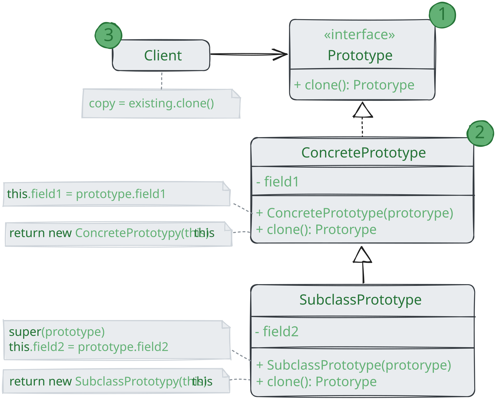
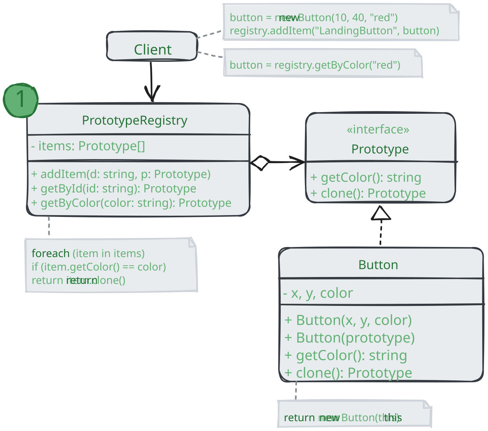

# Прототип

> _Также известен как: Клон, Prototype_

**Прототип** - это порождающий паттерн проектирования,
который позволяет копировать объекты, не вдаваясь в подробности их реализации.

### 💔 Проблема

У вас есть объект, который нужно скопировать. Как это сделать? Нужно создать пустой объект такого же класса,
а затем поочерёдно скопировать значения всех полей из старого объекта в новый.

Прекрасно! Но есть нюанс. Не каждый объект удастся скопировать таким образом, ведь часть его состояния
может быть приватной, а значит - недоступный для остального кода программы.

Но есть и другая проблема. Копирующий код станет зависим от классов копируемых объектов.
Ведь, чтобы перебрать _все_ поля объекта, нужно привязаться к его классу.
Из-за этого вы не сможете копировать объекты, зная только их интерфейсы, а не конкреные классы.

### 💚 Решение

Паттерн Прототип поручает создание копий самим копируемым объектам.
Он вводит общий интерфейс для всех объектов, поддерживающих клонирование.
Это позволяет копировать объекты, не привязываясь к их конкретным классам.
Обычно такой интерфейс имеет всего один метод `clone`.

Реализация этого метода в разных классах очень схожа.
Метод создаёт новый объект текущего класса и копирует в его значения всех полей собственного объекта.
Так получится скопировать даже приватные поля,
так как большинство языков программирования разрешает доступ к приватным полям любого объекта текущего класса.

Объект, которые копируют, называется _прототипом_ (оттуда и название паттерна).
Когда объекты программы содержат сотни полей и тысячи возможных конфигураций,
прототипы могут служить своеобразной альтернативой созданию подклассов.

В этом случае все возможные прототипы заготавливаются и настраиваются на этапе инициализации программы.
Потом, когда программе нужен новый объект, она создаёт копию из приготовленного прототипа. 

## Аналогия из жизни

В промышленном производстве прототипы создаются перед основной партией продуктов для проведения всевозможных испытаний.
При этом прототип не участвует в последующем производстве, отыгрывая пассивную роль.

Прототип на производстве не делает копию самого себя, поэтому более близкий пример паттерна - деление клеток.
После митозного деления клеток образуется две совершенно идентичные клетки.
Оригинальная клетка отыгрывает роль прототипа, принимая активное участие в создании нового объекта.

## Структура

1. **Интерфейс прототипов** описывает операции клонирования. В большинстве случаев - это единственный метод `clone`;
2. **Конкретный прототип** реализует операцию клонирования самого себя.
Помимо банального копирования значений всех полей, здесь могут быть спрятаны различные сложности, 
о которых не нужно знать клиенту. Например, клонирование связанных объектов,
распутывание рекурсивных зависимостей и прочее;
3. **Клиент** создаёт копию объекта, обращаясь к нему через общий интерфейс прототипов.

### Реализация с общим хранилищем прототипов

1. **Хранилище прототипов** облегчает доступ к часто используемым прототипам,
храня набор предварительно созданных эталонных, готовых к копированию объектов.
Простейшее хранилище может быть построено с помощью хещ-таблицы вида `имя-прототипа -> прототип`.
Но для удобства поиска прототипы можно маркировать и другими критериями, а не только условным именем.

## Применимость

🪲 **Когда ваш код не должен зависеть от классов копируемых объектов.**

_Такое часто бывает, если ваш код работает с объектами, поданными извне через какой-то общий интерфейс.
Вы не можете привязаться к их классам, даже если бы хотели поскольку их конкретные классы не известны.
Паттерн прототип предоставляет клиенту общий интерфейс для работы со всеми прототипами.
Клиенту не нужно зависеть от всех классов копируемых объектов, а только от интерфейса клонирования._

🪲 **Когда вы имеете уйму подклассов, которые отличаются начальными значениями полей.
Кто-то могу создать все эти классы, чтобы иметь возможность легко порождать объекты с определённой конфигурацией.**

_Паттерн Прототип предлагает использовать набор прототипов,
вместо создания подклассов для описания популярных конфигураций объектов.
Таким образом, вместо порождения объектов из подклассов, вы будете копировать существующие объекты-прототипы,
в которых уже настроено внутреннее состояние.
Это позволит избежать взрывного роста количества классов в программе и уменьшить её сложность._

## Шаги реализации

1. Создайте интерфейс, прототипов с единственным методом `clone`.
Если у вас уже есть иерархия продуктов, метод клонирования можно объявить непосредственно в каждом из её классов;
2. Добавьте в классы будущих прототипов альтернативный конструктор,
принимающий в качестве аргумента объект текущего класса. 
Этот конструктор должен скопировать из поданного объекта значения всех полей, объявленных в рамках текущего класса,
а затем передать выполнение родительскому конструктору, чтобы тот позаботился о полях объявленных в суперклассе.
Если ваш язык программирования не поддерживает перегрузку методов,
то вам не удастся создать несколько версий конструктора.
В этом случае копирование значений можно проводить и в другом методе, специально созданном для этих целей.
Конструктор удобен тем, что позволяет клонировать объект за один вызов;
3. Метод клонирования обычно состоит всего из одной строки: вызова оператора `new` с конструктором прототипа.
Все классы, поддерживающие клонирование, должны явно определить метод `clone`,
чтобы использовать собственный класс с оператором `new`.
В обратном случае результатом клонирования станет объект родительского класса;
4. Опционально, создайте центральное хранилище прототипов.
В нём удобно хранить вариации объектов, возможно, даже одного класса, но по-разному настроенных.
Вы можете разместить это хранилище либо в новом фабричном классе, либо в фабричном методе базового класса прототипов.
Такой фабричный метод должен на основании входящих аргументов искать в хранилище прототипов подходящий экземпляр,
а затем вызывать его метод клонирования и возвращать полученный объект.
Наконец, нужно избавиться от прямых вызовов конструкторов объектов,
заменив их вызовами фабричного метода хранилища прототипов.

## Преимущества и недостатки

* ✅ Позволяет клонировать объекты, не привязываясь к их конкретным классам;
* ✅ Менье повторяющегося кода инициализации объектов;
* ✅ Ускоряет создание объектов;
* ✅ Альтернатива созданию подклассов для конструирования сложных объектов;
* ❌ Сложно клонировать составные объекты, имеющие ссылки на другие объекты.

## Отношения с другими паттернами

* Многие архитектуры начинаются с применения **Фабричного метода**
  (более простого и расширяемого через подклассы) и эволюционирует в сторону **Абстрактной фабрики**,
  **Прототипа** или **Стратегии** (более гибких, но и более сложных);
* Классы **Абстрактной фабрики** чаще всего реализуются с помощью **Фабричного метода**,
  хотя они могут быть построены и на основе **Прототипа**;
* Если **Команду** нужно копировать перед вставкой в историю выполненных команд, вам может помочь **Прототип**;
* Архитектура, построенная на **Компоновщиках** и **Декораторах**,
  часто может быть улучшена за счёт внедрения **Прототипа**
  Он позволяет клонировать сложные структуры объектов, а не собирать их заново;
* **Прототип** не опирается на наследование, но ему нужна сложная операция инициализации.
  **Фабричный метод**, наоборот, построен на наследовании, ноне требует сложной инициализации;
* **Снимок** иногда можно заменить **Прототипом**, если объект, состояние которого требуется сохранить в истории,
  довольно простой, не имеет активных ссылок на внешние ресурсы либо их можно легко восстановить;
* **Абстрактная фабрика**, **Строитель** и **Прототип** могут быть реализованы при помощи **Одиночки**.