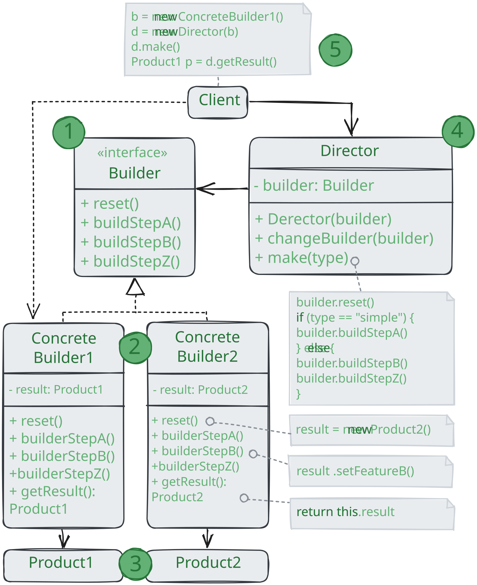

# Строитель

> _Также известный как: Builder_

**Строитель** - это порождающий паттерн проектирования, который позволяет создавать сложные объекты пошагово.
Строитель даёт возможность использовать один и тот же код строительства для получения разных представлений объектов.

### 💔 Проблема

Представьте сложный объект, требующий кропотливой пошаговой инициализации множества полей и вложенных объектов.
Код инициализации таких объектов обычно спрятан внутри монструозного конструктора с десятком параметров.
Либо ещё хуже - распылён по всему клиентскому коду. 

Например, давайте подумаем о том, как создать объект `Дом`. Чтобы построить стандартный дом, нужно поставить 4 стены,
установить двери, вставить пару окон и положить крышу.
Но что, если вы хотите дом побольше да посветлее, имеющий сад, бассейн и прочее добро?

Самое простое решение - расширить класс `Дом`, создав подклассы для всех комбинаций параметров дома.
Проблема такого подхода - это громадное количество классов, которые вам придётся создать.
Каждый новый параметр, вроде цвета обоев или материала кровли,
заставит вас создавать всё больше и больше классов для перечисления всех возможных вариантов.

Чтобы не плодить подклассы, вы можете подойти к решению с другой стороны.
Вы можете создать гигантский конструктор `Дома`, принимающий уйму параметров для контроля под создаваемым продуктом.
Действительно, это избавить вам от подклассов, но приведёт к другой проблеме.

Большая часть этих параметров будет простаивать, а вызовы конструктора будут выглядеть монструозно из-за
длинного списка параметров. К примеру, далеко не каждый дом имеет бассейн, поэтому параметры, связанные с бассейнами,
будут простаивать бесполезно в 99% случаев.

### 💚 Решение

Паттерн _Строитель_ предлагает вынести конструирование объекта за пределы его собственного класса,
поручив это дело отдельным объектам, называемым _строителями_.

Паттерн предлагает разбить процесс конструирования объекта на отдельные шаги
(например, `построитьСтены`, `вставитьСтены` и другие).
Чтобы создать объект, вам нужно поочерёдно вызывать методы строителя.
Причём не нужно запускать все шаги, а только те, что нужны для производства объекта определённой конфигурации.

Зачастую один и тот же шаг строительства может отличаться для разных вариаций производимых объектов.
Например, деревянный дом потребует строительства стен из дерева, а каменный - их камня.

В этом случае вы можете создать несколько классов строителей, выполняющих одни и те же шаги по-разному.
Используя этих строителей в одном и том же строительном процессе, вы сможете получать на выходе различные объекты.

Например, один строитель делает стены из дерева и стекла другой из камня и железа, третий из золота и бриллиантов.
Вызвав одни и те же шаги строительства, в первом случае вы получите обычный жилой дом, во втором - маленькую крепость,
а в третьем - роскошное жилище. Замечу, что код, который вызывает шаги строительства,
должен работать со строителями через общий интерфейс, чтобы их можно было свободно взаимозаменять.

#### Директор

Вы можете пойти дальше и выделить вызовы методов строителя в отдельный класс, называемый _директором_.
В этом случае директор будет задавать порядок шагов строительства, а строитель - выполнять их.

Отдельный класс директора не является строго обязательным.
Вы можете вызвать метод строителя и на прямую из клиентского кода.
Тем не менее, директор полезен, если у вас есть несколько способов конструирования продуктов,
отличающихся порядком и наличием шагов конструирования.
В этом случае вы сможете объединить всю логику в одном классе.

Такая структура классов полностью скроет от клиентского кода процесс конструирования объектов.
Клиенту останется только привязать желаемого строителя к директору, а затем получить у строителя готовый результат.

## Структура

1. **Интерфейс строителя** объявляет шаги конструирования продуктов, общие для всх видов строителей;
2. **Конкретные строители** реализуют строительные шаги, каждый по-своему.
Конкретные строители могут производить разнородные объекты, не имеющие общего интерфейса;
3. **Продукт** - создаваемый объект. Продукты, сделанные разными строителями, не обязаны иметь общий интерфейс;
4. **Директор** определяет порядок вызова строительных шагов для производства той или иной конфигурации продуктов;
5. Обычно **Клиент** подаёт в конструктор директора уже готовый объект-строитель,
и в дальнейшем данный директор использует только его.
Но возможен и другой вариант, когда клиенты передаёт строителя через параметр строительного метода директора.
В этом случае можно каждый раз применять разных строителей для производства различных представлений объектов.

## Применимость

🪲 **Когда вы хотите избавиться от «телескопического конструктора».**

_Допустим, у вас есть один конструктор с десятью опциональными параметрами.
Его неудобно вызывать, поэтому вы создали ещё десять конструкторов с меньшим количеством параметров.
Всё, что они делают - это переадресуют вызов к базовому конструктору,
подавая какие-то значения по умолчанию в параметры, которые пропущены в них самих.
Паттерн Строитель позволяет собирать объекты пошагово, вызывая только те шаги, которые вам нужны.
А значит, больше не нужно пытаться «запихнуть» в конструктор все возможные опции продукта._

🪲 **Когда ваш код должен создавать разные представления какого-то объекта.
Например, деревянные и железобетонные дома.**

_Строитель можно применить, если создание нескольких представлений объекта состоит из одинаковых этапов,
которые отличаются в деталях. Интерфейс строителей определит все возможные этапы конструирования.
Каждому представлению будет соответствовать класс-строитель.
А порядок этапов строительства будет задавать класс-директор._

🪲 **Когда вам нужно собирать сложные составные объекты, например, деревья Компоновщика.**

_Строитель конструирует объекты пошагово, а не за один проход.
Более того, шаги строительства можно выполнять рекурсивно.
А без этого не построить древовидную структуру, вроде Компоновщика.
Заметьте, что Строитель не позволяет посторонним объектам иметь доступ к конструируемому объекту,
пока тот не будет полностью готов. Это предохраняет клиентский код от получения незаконченных «битых» объектов._

## Шаги реализации

1. Убедитесь в том, что создание разных представлений объекта можно свести к общим шагам;
2. Опишите эти шаги в общем интерфейсе строителей;
3. Для каждого из представлений
объекта-продукта создайте по одному классу-строителю и реализуйте их методы строительства.
Не забудьте про метод получения результата.
Обычно конкретные строители определяют собственные методы получения результата строительства.
Вы не можете описать эти методы в интерфейсе строителей,
поскольку продукты не обязательно должны иметь общий базовый класс или интерфейс.
Но вы всегда сможете добавить метод получения результата в общий интерфейс,
если ваши строители производят однородные продукты с общим предком;
4. Подумайте о создании класса директора.
Его методы будут создавать различные конфигурации продуктов, вызывая разные шаги одного и того же строителя;
5. Клиентский код должен будет создавать и объекты строителей, и объект директора.
Перед началом строительства клиент должен связать определённого строителя с директором.
Это можно сделать либо через конструктор, либо через сеттер,
либо подав строителя напрямую в строительный метод директора;
6. Результат строительства можно вернуть из директора,
но только если метод возврата продукта удалось поместить в общий интерфейс строителей.
Иначе вы жёстко привяжите директора к конкретным классам строителей.

## Преимущества и недостатки

* ✅ Позволяет создавать продукты пошагово;
* ✅ Позволяет использовать один и тот же код для создания различных продуктов;
* ✅ Изолирует сложный код сборки продукта от его основной бизнес-логики;
* ❌ Усложняет код программы из-за введения дополнительных классов;
* ❌ Клиент будет привязан к конкретным классам строителей, 
так как в интерфейсе директора может не быть метода получения результата.

## Отношения с другими паттернами

* Многие архитектуры начинаются с применения **Фабричного метода**
  (более простого и расширяемого через подклассы) и эволюционирует в сторону **Абстрактной фабрики**,
  **Прототипа** или **Стратегии** (более гибких, но и более сложных);
* **Строитель** концентрируется на построении сложных объектов шаг за шагом.
**Абстрактная фабрика** специализируется на создании семейств связанный продуктов.
_Строитель_ возвращает продукт только после выполнения всех шагов, а _Абстрактная фабрика_ возвращает продукт сразу же;
* **Строитель** позволяет пошагово сооружать дерево **Компоновщика**;
* Паттерн **Строитель** может быть построен в виде **Моста**: _директор_ будет играть роль абстракции,
а _строители_ - реализации;
* **Абстрактная фабрика**, **Строитель** и **Прототип** могут быть реализованы при помощи **Одиночки**.