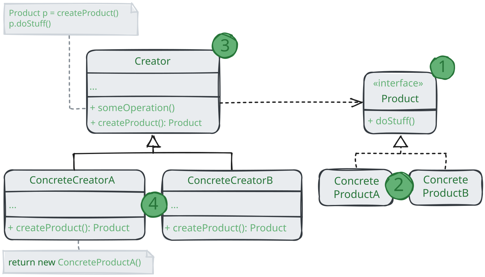

# Фабричный метод

> _Также известный как: Виртуальный конструктор, Factory Method_

**Фабричный метод** - это порождающий паттерн проектирования,
который определяет общий интерфейс для создания объектов в суперклассе,
позволяя подклассам изменять тип создаваемых объектов.

### 💔 Проблема

Представьте, что вы создаёте программу управления грузовыми перевозками.
Сперва вы рассчитываете перевозить товары только на автомобилях.
Поэтому весь ваш код работает с объектами класса `Грузовик`.

В какой-то момент ваша программа становится настолько известной,
что морские перевозки выстраиваются и просят добавить поддержку морской логистики в программу.

Отличные новости, правда?! Но как насчёт кода?
Большая часть существующего кода жёстко привязана к классам `Грузовиков`.
Чтобы добавить в программу классы морских `Судов`, понадобится перелопатить всю программу.
Более того, если вы потом решите добавить в программу ещё один вид транспорта, то всю работу придётся повторить.

В итоге вы получите ужасающий код, наполненный условными операторами,
которые выполняют то или иное действие, в зависимости от класса транспорта.

### 💚 Решение

Паттерн Фабричный метод предлагает создавать объекты не напрямую, используя оператор `new`,
а через вызов особого _фабричного_ метода. Не пугайтесь, объекты всё равно будут создаваться при помощи `new`,
но делать это будет фабричный метод.

На первый взгляд, это может показаться бессмысленным:
мы просто переместим вызов конструктора из одного класса программы в другой.
Но теперь вы сможете переопределить фабричный метод в подклассе, чтобы изменить тип создаваемого продукта.

Чтобы эта система заработала, все возвращаемые объекты должны иметь общий интерфейс.
Подклассы смогут производить объекты различных классов, следующих одному и тому же интерфейсу.

Например, класс `Грузовик` и `Судно` реализуют интерфейс `Транспорт` с методом `доставить`.
Каждый из этих классов реализует метод по-своему: грузовики везут грузы по земле, а суда - по морю.
Фабричный метод в классе `ДорожнойЛогистики` вернёт объект-грузовик, а класс `МорскойЛогистики` - объект-судно.

Для клиента фабричного метод нет разницы между этими объектами,
так как он будет трактовать их как некий абстрактный `Транспорт`.

Для него будет важно, чтобы объект имел метод `доставить`, а как конкретно он работает - не важно.

## Структура

1. **Продукт** определяет общий интерфейс объектов, которые может произвести создатель и его подклассы;
2. **Конкретные продукты** содержат код различных продуктов.
Продуты будут отличаться реализацией, но интерфейс у них будет общий;
3. **Создатель** объявляет фабричный метод, который должен возвращать новые объекты продуктов.
Важно, чтобы тип результата совпал с общим интерфейсом продуктов.
Зачастую фабричный метод объявляют абстрактный, чтобы заставить все подклассы реализовывать его по-своему.
Но он может возвращать и некий стандартный продукт.
Несмотря на название, важно понимать, что создание продуктов **не является** единственной функцией создателя.
Обычно он содержит и дугой полезный код работы с продуктом.
Аналогия: большая софтверная компания может иметь центр подготовки программистов,
но основная задача компании - создавать программные продукты, а не готовить программистов;
4. **Конкретные создатели** по-своему реализуют фабричный метод, производя те или иные продукты.
Фабричный метод не обязан всё время создавать новые объекты.
Его можно переписать так, чтобы возвращать существующие объекты из какого-то хранилища или кэша.

## Применимость

🪲 **Когда заранее неизвестны типы и зависимости объектов, с которым должен работать ваш код.**

_Фабричный метод отделяет код производства продуктов от остального кода, который эти продукты использует.
Благодаря этому, код производства можно расширять, не трогая основной.
Так, чтобы добавить поддержку нового продукта, вам нужно создать новый подкласс и определить в нём фабричный метод,
возвращая оттуда экземпляр нового продукта._

🪲 **Когда вы хотите дать возможность пользователям расширять части вашего фреймворка или библиотеки.**

_Пользователи могут расширять классы вашего фреймворка через наследование.
Но как сделать так, чтобы фреймворк создавал объекты из этих новых классов, а не из стандартных?
Решением будет дать пользователям возможность расширять не только желаемые компоненты,
но и классы, которые создают эти компоненты.
А для этого создающие классы должны иметь конкретные создающий методы, которые можно определить.
Например, вы используете готовый UI-фреймаворк для своего приложения.
Но вот беда - требуется иметь круглые кнопки, вместо стандартных прямоугольных.
Вы создаёте класс `RoundButton`. Но как сказать главному классу фреймворка `UIFramework`,
чтобы он теперь создавал круглые кнопки, вместо стандартных?
Для этого вы создаёте подкласс UIWithRoundButtons из базового класса фреймворка,
переопределяет в нём метод создания кнопки (а-ля `createButton`)_ и вписываете туда создание своего класса кнопок.
Затем используете `UIWithRoundButtons` вместо стандартного `UIFramework`.

🪲 **Когда хотите экономить системные ресурсы, повторно используя уже созданные объекты, вместо порождения новых.**

<i>
    Такая проблема обычно возникает при работе с тяжёлыми ресурсоёмкими объектами,
    такими, как подключение к базе данных, файловой системе и т.д.
    Представьте, сколько действий вам нужно совершить, чтобы повторно использовать существующие объекты:
    <ol>
        <li>Сначала вам следует создать общее хранилище, чтобы хранить в нём все создаваемые объекты;</li>
        <li>При запросе нового объекта нужно будет заглянуть в хранилище и проверить, если ли там неиспользуемый объект;</li>
        <li>А затем вернуть его клиентскому коду;</li>
        <li>Но если свободных объектов нет - создать новый, не забыв добавить его в хранилище.</li>
    </ol>
    Весь этот код нужно куда-то поместить, чтобы не засорять клиентский код.
    Самым удобным местом был бы конструктор объекта, ведь все эти проверки нужны только при создании объектов.
    Но, увы, конструктор всегда создает <b>новые</b> объекты, он не может вернуть существующий экземпляр.
    Значит, нужен другой метод, которые бы отдавал как существующие, так и новые объекты. Им и станет фабричный метод.
</i>

## Шаги реализации

1. Приведите все создаваемые продукты к общему интерфейсу;
2. В классе, которые производит продукты, создайте пустой фабричный метод.
В качестве возвращаемого типа укажите общий интерфейс продукта;
3. Затем пройдитесь по коду класса и найдите все участки, создающие продукты.
Поочерёдно замените эти участки вызовами фабричного метода, перенося в него код создавания различных продуктов.
В фабричный метод, возможно, придётся добавить несколько параметров, контролирующих, какой из продуктов нужно создать.
На этом этапе фабричный метод, скорее всего, будет выглядеть удручающе.
В нё будет жить большой условный оператор, выбирающий класс создаваемого продукта.
Но не волнуйтесь, мы вот-вот исправим это;
4. Для каждого типа продуктов заведите подкласс и переопределите в нём фабричный метод.
Переместите туда код создания соответствующего продукта из суперкласса;
5. Если создаваемых продуктов слишком много для существующих подклассов создателя,
вы можете подумать о введении параметров в фабричный метод,
которые позволяет возвращать различные продукты в пределах одного подкласса.
Например, у вас есть класс `Почта` с подклассами `АвиаПочта` и `НаземнаяПочта`,
а также классы продуктов `Самолёт`, `Грузовик` и `Поезд`.
`Авиа` соответствует `Самолётам`, но для `Наземной почты` есть сразу два продукта.
Вы могли бы создать новый класс почты для поездов, но проблему можно решить и по-другому.
Клиентский код может передавать в фабричный метод передавать в фабричный метод `НазвемнойПочты` аргумент,
контролирующих тип создаваемого продукта;
6. Если после всех перемещений фабричный метод стал пустым, можете сделать его абстрактным.
Если в нём что-то осталось - не беда, это буде его реализацией по умолчанию.

## Преимущества и недостатки

* Избавляет класс от привязки к конкретным классам продуктов;
* Выделяет код производства продуктов в одно место, упрощая поддержку кода;
* Упрощает добавление новых продуктов в программу;
* Реализует _принцип открытости/закрытости_;
* Может привести к созданию больших параллельных иерархий классов,
так как для каждого класса продукта надо создать свой подкласс создателя.

## Отношения с другими паттернами

* Многие архитектуры начинаются с применения **Фабричного метода**
(более простого и расширяемого через подклассы) и эволюционирует в сторону **Абстрактной фабрики**,
**Прототипа** или **Стратегии** (более гибких, но и более сложных);
* **Фабричный метод** можно использовать вместе с **Итератором**,
чтобы подклассы коллекций могли создавать подходящие им итераторы;
* Классы **Абстрактной фабрики** чаще всего реализуются с помощью **Фабричного метода**,
хотя они могут быть построены и на основе **Прототипа**;
* **Прототип** не опирается на наследование, но ему нужна сложная операция инициализации.
**Фабричный метод**, наоборот, построен на наследовании, ноне требует сложной инициализации;
* **Фабричный метод** можно рассматривать как частный случай **Шаблонного метода**.
Кроме того, _Фабричный метод_ нередко бывает частью большого класса с Шаблонными методами.