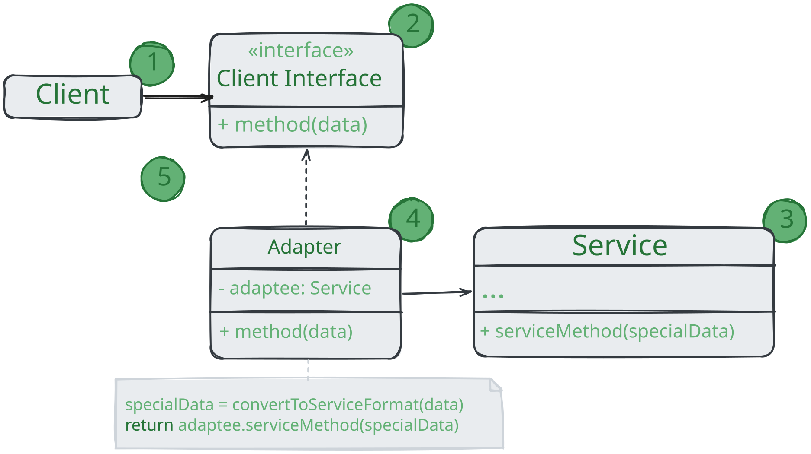
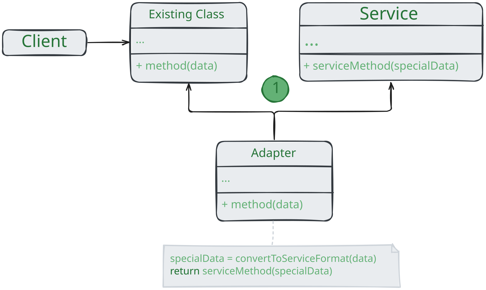

# Адаптер
> *Также известен как: Wrapper, Обёртка, Adapter*

**Адаптер** - это структурный паттерн проектирования,
который позволяет объектам с несовместимыми интерфейсами работать вместе.

### 💔 Проблема

Представьте, что вы делаете приложение для торговли на бирже.
Ваше приложение скачивает биржевые котировки из нескольких источников в XML,
а затем рисует красивые графики.

В какой-то момент вы решаете улучшить приложение, применив стороннюю библиотеку аналитики.
Но вот беда - библиотека поддерживает только формат данных JSON несовместимый с вашим приложением.

Вы могли бы переписать библиотеку, чтобы та поддерживала формат XML.
Но, во-первых, это может нарушить работу существующего код, который зависит от бибилиотеки.
А во-вторых, у вас может просто не быть доступа к её исходному коду.

### 💚 Решение

Вы можете создать *адаптер*. Это объект-переводчик,
который трансформирует интерфейс или данные одного объекта в такой вид, чтобы он стал понятен другому объекту.

При этом адаптер оборачивает один из объектов так, что другой объект даже не знает о наличии первого.
Например, вы можете обернуть объект, работающий в метрах, адаптером, который конвертировал бы данные в футы.

Адаптеры могут не только переводить данные из одного формата в другой,
но и помогать объектам с разными интерфейсами работать сообща. Это работает так:

1. Адаптер имеет интерфейс, который совместим с одним из объектов;
2. Поэтому этот объект может свободно вызывать методы адаптера;
3. Адаптер получает эти вызовы и перенаправляет их второму объекту, но уже в том формате и последовательности,
которые понятны второму объекту.

Иногда возможно сделать даже *двухсторонний адаптер*, который работал бы в обе стороны.

Таким образом, в приложении биржевых котировок вы могли бы создать класс `XmlToJsonAdapter`,
который бы оборачивал объект того или иного класса библиотеки аналитики.
Ваш код посылал бы адаптеру запросу в формате XML, а адаптер сначала транслировал входящие данные в формат JSON,
а затем передавал бы их методам обёрнутого объекта аналитики. 

### Аналогия из жизни

Когда вы в первый раз летите за границу, вас может ждать сюрприз при попытке зарядить ноутбук.
Стандарты розеток в разных странах отличаются.

Ваша европейская зарядка будет бесполезна в США специального адаптера, позволяющего подключиться к розетке другого типа.

## Структура

### Адаптер объектов

Эта реализация использует агрегацию: объект адаптера «оборачивает», то есть содержит ссылку на служебный объект.
Такой подход работает во всех языках программирования.

1. **Клиент** - это класс, который содержит существующую бизнес-логику программы;
2. **Клиентский интерфейс** описывает протокол, через который клиент может работать с другими классами;
3. **Сервис** - это какой-то полезный класс, обычно сторонний. Клиент не может использовать этот класс,
так как сервис имеет непонятный ему интерфейс;
4. **Адаптер** - это класс, который может одновременно работать и с клиентом, и с сервисом.
Он реализует клиентский интерфейс и содержит ссылку на объект сервиса.
Адаптер получает вызовы от клиента через методы клиентского интерфейса,
а затем переводит их вызовы методов обёрнутого объекта в правильном формате;
5. Работая с адаптером через интерфейс, клиент не привязывается к конкретному классу адаптера.
Благодаря этому вы можете добавлять в программу новые виды адаптеров, независимо от клиентского кода.
Это может пригодиться, если интерфейс сервиса вдруг изменится, например, после выхода новой версии сторонней библиотеки.

### Адаптер классов

Эта реализация базируется на наследовании: адаптер наследует оба интерфейса одновременно.
Такой подход возможен только в языках поддерживающих множественное наследование, например, C++:

1. **Адаптер классов** не нуждается во вложенном объекте,
так как он может одновременно наследовать и часть существующего класса, и часть сервиса. 

## Применимость

* Когда вы хотите использовать сторонний класс, но его интерфейс не соответствует остальному коду приложения;
* Адаптер позволяет создать объект-прокладку,
который будет превращать вызовы приложения в формат, понятный стороннему классу;
* Когда вам нужно использовать несколько существующих подклассов, но в них не хватает какой-то общей функциональности,
причём расширить суперкласс вы не можете;
* Вы могли бы создать ещё один уровень подклассов и добавить в них недостающую функциональность.
Но при этом придётся дублировать один и тот же од в обеих ветках подклассов;

## Шаги реализации

1. Убедитесь, что у вас есть два класса с несовместимыми интерфейсами:
> * полезный сервис - служебный класс, который вы не можете изменять (он либо сторонний, либо от него зависит другой код);
> * один или несколько клиентов - существующих классов приложения, несовместимых с сервисом из-за неудобного или несовпадающего интерфейса;
2. Опишите клиентский интерфейс, через который классы приложения смогли бы использовать класс сервиса;
3. Создайте класс адаптера, реализовав этот интерфейс;
4. Поместите в адаптер поле, которое будет хранить ссылку на объект сервиса.
Обычно это поле заполняют объектом, переданным в конструктор адаптера. В случае простой адаптации этот объект можно передавать через параметры методов адаптера;
5. Реализуйте все методы клиентского интерфейса в адаптере. Адаптер должен делегировать основную работу сервису;
6. Приложение должно использовать адаптер только через клиентский интерфейс.
Это позволит легко изменять и добавлять адаптеры в будущем.

## Преимущества и недостатки
* ✅ Отделяет и скрывает от клиента подробности преобразования различных интерфейсов;
* ❌ Усложняет код программы из-за введения дополнительных классов.

## Отношения с другими паттернами

* Мост проектируют загодя, чтобы развивать большие части приложения отдельно друг от друга.
Адаптер же применяют постфактум, чтобы заставить несовместимые классы работать вместе;
* Адаптер меняет интерфейс существующего объекта. Декоратор улучшает другой объект без изменения его интерфейса.
Причём Декоратор поддерживает рекурсивную вложенность, чего не скажешь об Адаптере;
* Адаптер предоставляет классу альтернативный интерфейс. Декоратор предоставляет расширенный интерфейс.
Заместитель предоставляет тот же интерфейс.
* Фасад задаёт новый интерфейс, тогда как Адаптер повторно использует старый.
Адаптер оборачивает только один класс, а Фасад оборачивает целую подсистему. Кроме того,
Адаптер позволяет двум существующим интерфейсам работать сообща, вместо того, чтобы задать полностью новый.
* Мост, Стратегия и Состояние (а также слегка и Адаптер) имеют схожие структуры классов - все они построены
на принципе «композиции», то есть делегирования работы другим объектам.
Тем не менее, они отличаются тем, что решают разные проблемы.
Помните, что паттерны - это не только рецепт построения кода определённым образом,
но и описание проблем, которые привели к данному решению.  