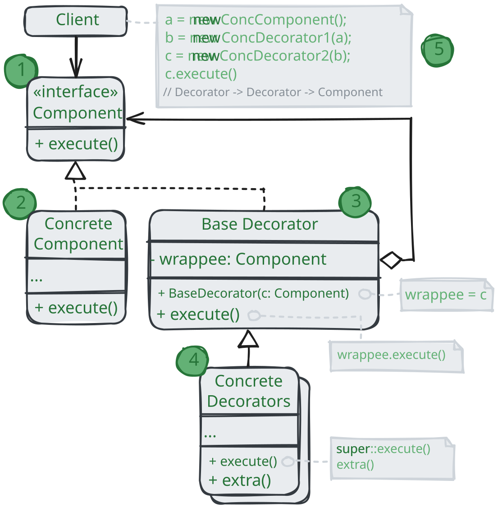

# Декоратор

> _Также известен как: Wrapper, Обёртка, Decorator_

**Декоратор** - это структурный паттерн проектирования,
который позволяет динамически добавлять объектам новую функциональность, оборачивая их в полезные «обёртки».

### 💔 Проблема

Вы работаете над библиотекой, которую можно подключать к разнообразным программам,
чтобы получать уведомления о разных событиях.

Основой библиотеки является класс `Notifier` с методом `send`,
который принимает на вход строку-сообщение и высылает её всем администраторам по электронной почте.
Сторонняя программа должна создать и настроить этот объект, указав кому отправлять оповещение,
а затем использовать его каждый раз, когда что-то случается.

В какой-то момент стало понятно, что одних email-оповещений пользователям мало.
Некоторые из них хотели бы получать извещения о критических проблемах через SMS.
Другие хотели бы получать их в виде сообщений Facebook. Корпоративные пользователи хотели бы видеть сообщение в Slack.

Сначала вы добавили каждый из этих типов оповещений в программу, унаследовав их от базового класса `Notifier`.
Теперь пользователь выбирал один из типов оповещений, который и использовался в дальнейшем.

Но затем кто-то резонно спросил, почему нельзя выбирать несколько типов оповещений сразу?
Ведь если вдруг в вашем доме начался пожар, вы бы хотели получить оповещения по всем каналам, не так ли?

Вы попытались реализовать все возможные комбинации подклассов оповещений.
Но после того как вы добавили первый десяток классов, стало ясно, что такой подход невероятно раздувает код программы.

Итак, нужен какой-то другой способ комбинирования поведения объектов,
который не приводит к взрыву количества подклассов.

### 💚 Решение

Наследование - это первое, что приходит в голову многим программистам,
когда нужно расширить какое-то существующее поведение. Но механизм наследования имеет несколько досадных проблем.

* Он **статичен**. Вы не можете изменить поведение существующего объекта.
Для этого вас надо создать новый объект, выбрав другой подкласс;
* Он **не разрешает наследовать поведение нескольких классов одновременно**.
Из-за этого вам приходится создавать множество подклассов-комбинаций для получения совмещённого поведения.

Одним из способов обойти эти проблемы является замена наследования _агрегацией_ либо _композицией_.
Это когда один и тот же объект _содержит_ ссылку на другой и делегирует ему работу, вместо того,
чтобы самому наследовать его поведение. Как раз на этом принципе построен паттерн Декоратор.

Декоратор имеет альтернативное название - _обёртка_. Оно более точно описывает суть паттерна:
вы помещаете целевой объект в другой объект-обёртку, который запускает базовое поведение объекта,
а затем добавляет к результату что-то своё.

Оба объекта имеют общий интерфейс, поэтому для пользователя нет никакой разницы,
с каким объектом работать - чистым или обернутым.
Вы можете использовать несколько разных обёрток одновременно - результат будет иметь
объединённое поведение всех обёрток сразу.

В примере с оповещениями мы оставим в базовом классе простую отправку по электронной почте,
а расширенные способы отправки сделаем декораторами.

Сторонняя программа, выступающая клиентом,
во время первичной настройки будет заворачивать объект оповещений в те обёртки,
которые соответствуют желаемому способу оповещения.

Последняя обёртка в списке и будет тем объектом, с которым клиент будет работать в остальное время.
Для остального клиентского кода, по сути, ничего не изменится, ведь все обёртки имеют точно такой же интерфейс,
что и базовый класс оповещений.

Таким же образом можно изменять не только способ доставки оповещений, но и форматирование, список адресатов и так далее.
К тому же клиент может «дообернуть» объект любыми другими обёртками, когда ему захочется.

### Аналогия из жизни

Любая одежда - это аналог Декоратора.
Применяя Декораторы, вы не меняете первоначальный класс и не создаёте дочерних классов.
Так и с одеждой - надевая свитер, вы не перестаёте быть собой, но получаете новое свойство - защиту от холода.
Вы можете пойти дальше и надеть сверху ещё один декоратор - плащ, чтобы защититься и от дождя.

## Структура

1. **Компонент** задаёт общий интерфейс обёрток и оборачиваемых объектов;
2. **Конкретный компонент** определяет класс оборачиваемых объектов. Он содержит какое-то базовое поведение,
которое потом изменяют декораторы;
3. **Базовый декоратор** хранит ссылку на вложенный объект компонент. Им может быть как конкретный компонент,
так и один из конкретных декораторов. Базовый декоратор делегирует все свои операции вложенному объекту.
Дополнительное поведение будет жить в конкретных декораторах;
4. **Конкретный декоратор** - это различные вариации декораторов, которые содержат добавочное поведение.
Оно выполняется до или после вызова аналогичного поведения обёрнутого объекта;
5. **Клиент** может оборачивать простые компоненты и декораторы в другие декораторы,
работая со всеми объектами через общий интерфейс компонентов.

## Применимость

🪲 **Когда вам нужно добавлять обязанности объектам на лету незаметно для кода, которых их использует.**

_Объект помещают в обёртки, имеющие дополнительные поведения. Обёртки и сами объекты имеют одинаковый интерфейс,
поэтому клиентам без разницы, с чем работать - с обычным объектом данных или с обёрнутым._

🪲 **Когда нельзя расширить обязанности объекта с помощью наследования.**

_Во многих языках программирования есть ключевое слово `final`, которое может заблокировать наследование класса.
Расширить такие классы можно только с помощью Декоратора._

## Шаги реализации

1. Убедитесь, что в вашей задаче есть один основной компонент и несколько опциональных дополнений или надстроек над ним;
2. Создайте интерфейс компонента, которые описывал бы общие методы как для основного компонента,
так и для его дополнений;
3. Создайте класс конкретного компонента и поместите в него основную бизнес-логику;
4. Создайте базовый класс декораторов. Он должен иметь поле для хранения ссылки на вложенный объект-компонент.
Все методы базового декоратора должны делегировать действие вложенному объекту;
5. И конкретный компонент, и базовый декоратор должны следовать одному и тому же интерфейсу компонента;
6. Теперь создайте класс конкретных декораторов, наследуя их от базового декоратора.
Конкретный декоратор должен выполнять свою добавочную функцию,
а затем (или перед этим) вызывать эту же операцию обёрнутого объекта;
7. Клиент берёт на себя ответственность за конфигурацию и порядок обёртывания объектов.

## Преимущества и недостатки

* ✅ Большая гибкость, чем у наследования;
* ✅ Позволяет добавлять обязанности на лету;
* ✅ Можно добавлять несколько новых обязанностей сразу;
* ✅ Позволяет иметь несколько мелких объектов вместо одного объекта на все случаи жизни;
* ❌ Трудно конфигурировать многократно обёрнутые объекты;
* ❌ Обилие крошечных классов.

## Отношения с другими паттернам

* **Адаптер** меняет интерфейс существующего объекта. **Декоратор** улучшает другой объект без изменения его интерфейса.
Причём _Декоратор_ поддерживает рекурсивную вложенность, чего не скажешь об _Адаптере_;
* **Адаптер** предоставляет классу альтернативный интерфейс, **Декоратор** предоставляет расширенный интерфейс.
**Заместитель** предоставляет тот же интерфейс;
* **Цепочка обязанностей** и **Декоратор** имеют очень похожие структуры.
Оба паттерна базируются на принципе рекурсивного выполнения операции через серию связанных объектов.
Но есть и несколько важных отличий. Обработчики в _Цепочке обязанностей_ 
выполнять произвольные действия, независимые друг от друга,
а также в любой момент прерывать дальнейшую передачу по цепочке.
С другой стороны _Декораторы_ расширяют какое-то определённое действие,
не ломая интерфейс базовой операции и не прерывая выполнение остальных декораторов;
* **Компоновщик** и **Декоратор** имеют похожие структуры классов из-за того,
что оба построены на рекурсивной вложенности. Она позволяет связать в одну структуру бесконечное количество объктов.
_Декоратор_ оборачивает только один объект, а узел _Компоновщика_ может иметь много детей.
_Декоратор_ добавляет вложенному объекту новую функциональность, а _Компоновщик_ не добавляет ничего нового,
но «суммирует» результаты всех свох детей. Но они могут сотрудничать: _Компоновщик_ может использовать _Декоратор_,
чтобы переопределить функции отдельных частей дерева компонентов;
* Архитектура, построенная на **Компоновщиках** и **Декораторах**,
часто может быть улучшена за счёт внедрения **Прототипа**.
Он позволяет клонировать сложные структуры объектов, а не собирать их заново;
* **Стратегия** меняет поведение объекта «изнутри», а **Декоратор** изменяет его «снаружи»;
* Декоратор и Заместитель имеют схожие структуры, но разные назначения.
Они похожи тем, что оба построены на принципе композиции и делегируют работу другим объектам.
Паттерны отличаются тем, что _Заместитель_ сам управляет жизни своего сервисного объекта, 
а обёртывание _Декораторов_ контролируется клиентом.