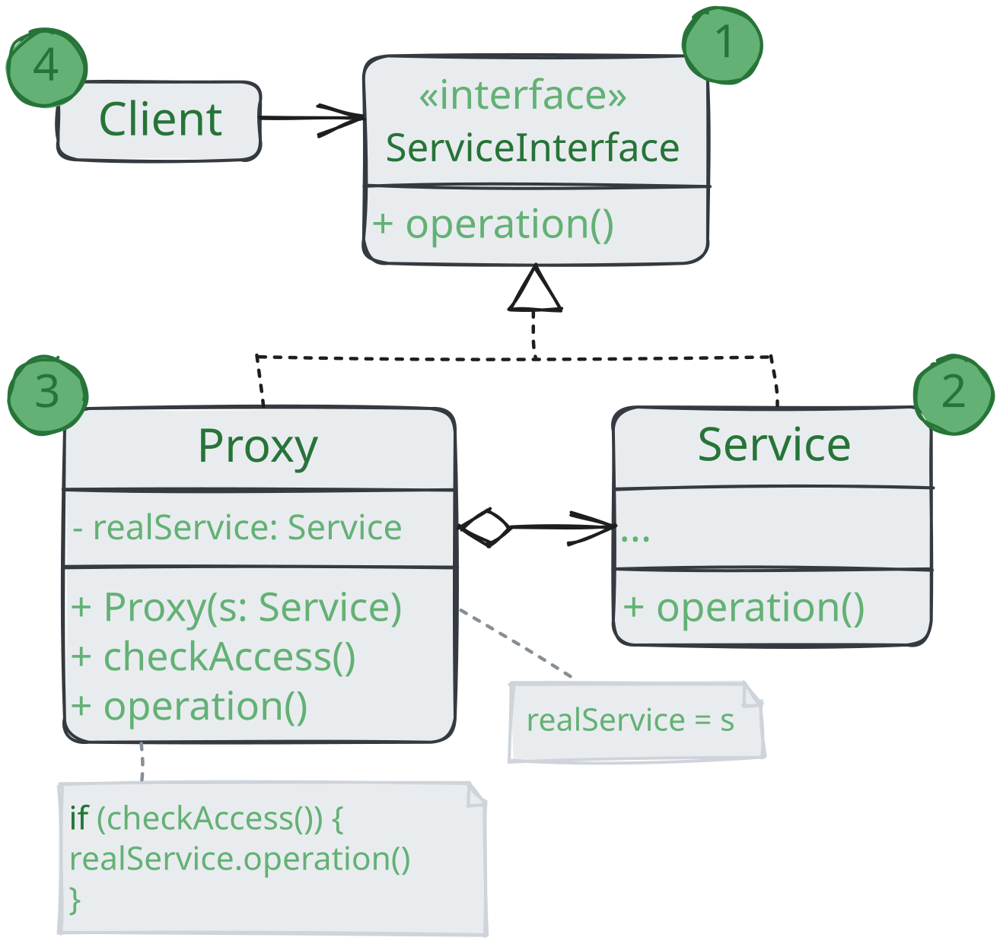

# Заместитель

> _Также известен как: Proxy_

**Заместитель** - это структурный паттерн проектирования,
который позволяет подставлять вместо реальных объектов специальные объекты заменители.
Эти объекты перехватывают вызовы к оригинальному объекту,
позволяя сделать что-то _до_ или _после_ передачи вызова оригиналу.

### 💔 Проблема

Для чего вообще контролировать доступ к объектам? Рассмотрим такой пример: у вас есть внешний ресурсоёмкий объект,
который нужен не все время, а изредка.

Мы могли бы создавать этот объект не в самом начале программы, а только тогда, когда он кому-то реально понадобится.
Каждый клиент объекта получил бы некий код отложенной инициализации.
Но, вероятно, это привело бы к множественному дублированию кода.
В идеале, этот код хотелось бы поместить прямо в служебный класс, но это не всегда возможно.
Например, код класса может находиться в закрытой сторонней библиотеке.

### 💚 Решение

Паттерн Заместитель предлагает создать новый класс дублёр,
имеющий тот же интерфейс, что и оригинальный служебный объект. При получении запрос от клиента объект-заместитель
сам бы создавал экземпляр служебного объекта и переадресовывал бы ему всю реальную работу.

Но в чем же здесь польза? Вы могли бы поместить в класс заместителя какую-то логику,
которая выполнялась бы _до_ или _после_ вызова этих же методов в настоящем объекте. А благодаря одинаковом интерфейсу,
объект-заместитель можно передать в любой код, ожидающий сервисный объект.

### Аналогия из жизни

Платёжная карточка - это заместитель пачки наличных.
И карточка, и наличные имеют общий интерфейс - ими можно оплачивать товары.
Для покупателя польза в том, что не надо таскать с собой тонны наличных, а владелец магазина рад,
что ему не нужно делать дорогостоящую инкассацию наличности в банк - деньги поступают к нему на счёт напрямую. 

## Структура

1. **Интерфейс сервиса** определяет общий интерфейс для сервиса и заместителя.
Благодаря этому объект заместителя можно использовать там, где ожидается объект сервиса;
2. **Сервис** содержит полезную бизнес-логику;
3. **Заместитель** хранит ссылку на объект сервиса.
После того как заместитель заканчивает свою работу (например, инициализацию, логирование, защите или другое),
он предаёт вложенному сервису. Заместитель может сам отвечать за создание и удаление объекта сервиса;
4. **Клиент** работает с объектами через интерфейс сервиса. Благодаря этому, его можно «одурачить»,
подменив объект сервиса объектом заместителя.

## Применимость

🪲 **Ленивая инициализация (виртуальный прокси). Когда у вас есть тяжёлый объект,
грузящий данные из файловой системы или базы данных.**

_Вместо того, чтобы грузить данные сразу после старта программы, можно сэкономить ресурсы и создать объект тогда,
когда он действительно понадобится._

🪲 **Защита доступа (защищающий прокси). Когда в программе есть разные типы пользователей,
и вам хочется защищать объект от неавторизованного доступа.
Например, если ваши объекты - это важная часть операционной системы,
а пользователи - сторонние программы (хорошие или вредоносные).**

_Прокси может проверять доступ при каждом вызове и передавать выполнение служебному объекту, если доступ разрешен._

🪲 **Локальный запуск сервиса (удаленный прокси). Когда настоящий сервисный объект находится на удалённом сервере.**

_В этом случае заместитель транслирует запросы клиента в вызов по сети в протоколе, понятном удалённому сервису._

🪲 **Логирование запросов (логирующий прокси). Когда требуется хранить историю обращений к сервисному объекту.**

_Заместитель может сохранять историю обращений клиента к сервисному объекту._

🪲 **Кеширование объектов («умная» ссылка).
Когда нужно кешировать результаты запроса клиентов и управлять их жизненным циклом.**

_Заместитель может подсчитывать количество ссылок на сервисный объект,
который были отданы клиенты и остаются активными.
Когда все ссылки освобождаются, можно будет освободить и сам сервисный объект
(например, закрыть подключение к базе данных).
Кроме того, Заместитель может отслеживать, не менял ли клиент сервисный объект.
Это позволит использовать объекты повторно и здорово экономить ресурсы,
особенно если речь идет о больших прожорливых сервисах._

## Шаги реализации

1. Определите интерфейс, который бы сделал заместитель и оригинальный объект взаимозаменяемыми;
2. Создайте класс заместителя. Он должен содержать ссылку на сервисный объект.
Чаще всего, сервисный объект создаётся самим заместителем.
В редких случаях заместитель получат готовый сервисный объект от клиента через конструктор;
3. Реализуйте методы заместителя от его предназначения. В большинстве случаях, проделав какую-то полезную работу,
методы заместителя должны передать запрос сервисному объекту;
4. Подумайте о введении фабрики, которая решала бы,
какой из объектов создавать - заместитель или реальный сервисный объект.
Но, с другой стороны, эта логика может быть помещена в создающий метод самого заместителя;
5. Подумайте, не реализовать ли вам ленивую инициализацию сервисного объекта 
при первом обращении клиента к методам заместителя.

## Преимущества и недостатки

* ✅ Позволяет контролировать сервисный объект незаметно для клиента;
* ✅ Может работать, даже если сервисный объект ещё не создан;
* ✅ Может контролировать жизненный цикл служебного объекта;
* ❌ Усложняет код программы из-за введения дополнительных классов;
* ❌ Увеличивает время отклика сервиса.

## Отношения с другими паттернами

* **Адаптер** предоставляет классу альтернативный интерфейс.
**Декоратор** предоставляет расширенный интерфейс. **Заместитель** предоставляет тот же интерфейс;
* **Фасад** похож на **Заместитель** тем, что замещает сложную подсистему и может сам её инициализировать.
Но в отличие от _Фасада_, _Заместитель_ имеет тот же интерфейс, что его служебный объект,
благодаря чему их можно взаимозаменять;
* **Декоратор** и **Заместитель** имеют схожие структуры, но разные назначения.
Они похожи ем, что оба построены на принципе композиции и делегируют работу другим объектам.
Паттерны отличатся тем, что _Заместитель_ сам управляет жизнью сервисного объекта,
а обёртывание _Декораторов_ контролируется клиентом.