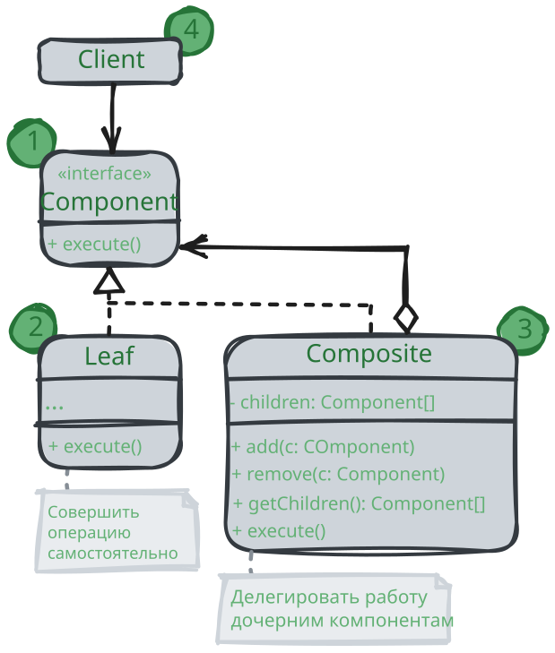

# Компоновщик

> _Также известен как: Дерево, Composite_

**Компоновщик** - это структурный паттерн проектирования,
который позволяет сгруппировать множество объектов в древовидную структуру,
а затем работать с ней так, как будто это единичный объект.

### 💔 Проблема

Паттерн Компоновщик имеет смысл только тогда,
когда основная модель вашей программы может быть структурирована в виде дерева. 

Например, есть два объекта: `Продукт` и `Коробка`.
`Коробка` может содержать несколько `Продуктов` и других `Коробок` поменьше.
Те, в свою очередь, тоже содержат либо `Продукты`, либо `Коробки` и так далее.

Теперь предположим, ваши `Продукты` и `Коробки` могут быть частью заказов.
Каждый заказ может содержать как простые `Продукты` без упаковки, так и составные `Коробки`.
Ваша задача состоит в том, чтобы узнать цену всего заказа.

Если решать задачу в лоб, то вам потребуется открыть все коробки заказа,
перебрать все продукты и посчитать их суммарную стоимость.
Но это слишком хлопотно, так как типы коробок и их содержимое могут быть вам неизвестны.
Кроме того, наперёд неизвестно и количество уровней вложенности коробок,
потому перебрать коробки простым циклом не выйдет.

### 💚 Решение

Компоновщик предлагает рассматривать `Продукт` и `Коробку` через единый интерфейс с общим методом получения стоимости.

`Продукт` просто вернёт свою цену. `Коробка` спросит цену каждого предмета внутри себя и вернёт сумму результатов.

Если одним из внутренних предметов окажется коробка поменьше, она тоже будет перебирать своё содержимое,
и так далее, пока не будут посчитаны все составные части.

Для вас, клиента, главное, что теперь не нужно ничего знать о структуре заказов.
Вы вызываете метод получения цены, он возвращает цифру, а вы не тонете в горах картона и скотча.

### Аналогия из жизни

Армии большинства государств могут быть представлены в виде перевёрнутых деревьев.
На нижнем уровне у вас есть солдаты, затем взводы, затем полки, затем целые армии.
Приказы отдаются сверху и спускаются вниз по структуре командования, пока не доходят до конкретного солдата.

## Структура

1. **Компонент** определяет общий интерфейс для простых и составных компонентов дерева;
2. **Лист** - это простой компонент дерева, не имеющий ответвлений. Из-за того, что им некому больше передавать выполнение,
классы листьев будут содержвать большую часть полезного кода;
3. **Контейнер** (или _композит_) - это составной компонент дерева. Он содержит набор дочерних компонентов,
но ничего не знает об их типах. Это могут быть как простые компоненты-листья, так и другие компоненты-контейнеры.
Но это не является проблемой, если все дочерние компоненты следуют единому интерфейсу.
Методы контейнера переадресуют основную работу своим дочерним компонентам,
хотя и могут добавлять что-то своё к результату;
4. **Клиент** работает с деревом через общий интерфейс компонентов.
Благодаря этому клиенту не важно, что перед ним находится - простой или составной компонент дерева.

## Применимость

🪲 **Когда вам нужно представить древовидную структуру объектов.**

_Паттерн компоновщик предлагает хранить в составных объектах ссылки на другие объекты простые или составные.
Те, в свою очередь, тоже могут хранить свои вложенные объекты и так далее.
В итоге вы можете строить сложную древовидную структуру данных, используя всего две основные разновидности объектов._

🪲 **Когда клиенты должны единообразно трактовать простые и составные объекты.**

_Благодаря тому, что простые и составные объекты реализуют общий интерфейс,
клиенту безразлично, с каким именно объектом ему предстоит работать._

## Шаги реализации

1. Убедитесь, что вашу бизнес-логику можно представить как древовидную структуру.
Попытайтесь разбить её на простые компоненты и контейнеры.
Помните, что контейнеры могут содержать как простые компоненты, так и другие вложенные контейнеры;
2. Создайте общий интерфейс контейнеров и простых компонентов дерева.
Интерфейс будет удачным, если вы сможете использовать его,
чтобы взаимозаменять простые и составные компоненты без потери смысла;
3. Создайте класс компонентов-листьев, не имеющих дальнейших ответвлений.
Имейте в виду, что программа может содержать несколько таких классов;
4. Создайте класс компонентов-контейнеров и добавьте в него массив для хранения ссылок на вложенные компоненты.
Этот массив должен быть способен содержать как простые так и составные компоненты,
поэтому убедитесь, что он объявлен с типом интерфейса компонентов.
Реализуйте в контейнере методы интерфейса компонентов помня о том,
что контейнеры должны делегировать основную работу своим дочерним компонентам;
5. Добавьте операции добавления и удаления дочерних компонентов в класс контейнеров.
Имейте в виду, что методы добавления/удаления дочерних компонентов можно поместить и в интерфейс компонентов.
Да, это нарушить _принцип разделения интерфейса_, так как реализации методов будут пустыми в компонентах-листьях.
Но зато все компоненты дерева станут действительно одинаковыми для клиента.

## Преимущества и недостатки

* ✅ Упрощает архитектуру клиента при работе со сложным деревом компонентов;
* ✅ Облегчает добавление новых видов компонентов;
* ❌ Создает слишком общий дизайн классов.

## Отношения с другими паттернами

* **Строитель** позволяет пошагово сооружать дерево **Компоновщика**;
* **Цепочку обязанностей** часто используют вместе с **Компоновщиком**.
В этом случае запрос передаётся от дочерних компонентов к их родителям;
* Вы можете обходить дерево **Компоновщика**, используя **Итератор**;
* Вы можете выполнять какое-то действие над всем деревом **Компоновщика** при помощи **Посетителя**;
* **Компоновщик** часто совмещают с **Легковесом**, чтобы реализовать общие ветки дерева и сэкономить при этом память;
* **Компоновщик** и **Декоратор** имеют похожие структуры классов из-за того,
что оба построены на рекурсивной вложенности. Она позволяет связать в одну структуру бесконечное количество объектов.
_Декоратор_ оборачивает только один объект, а узел _Компоновщика_ может иметь много детей.
_Декоратор_ добавляет вложенному объекту новую функциональность, а _Компоновщик_ не добавляет ничего нового,
но «суммирует» результаты всех своих детей. Однако они могут сотрудничать: _Компоновщик_ может использовать 
_Декоратор_, чтобы переопределить функции отдельных частей дерева компонентов;
* Архитектура, построенная на **Компоновщиках** и **Декораторах**,
часто может быть улучшена за счёт внедрения **Прототипа**
Он позволяет клонировать сложные структуры объектов, а не собирать их заново.