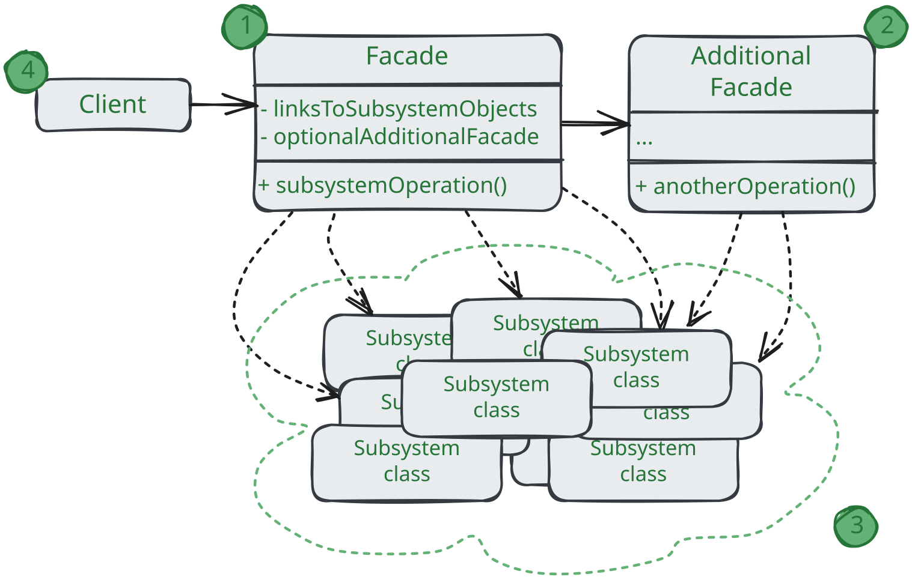

# Фасад

> Также известен как: Facade

**Фасад** - это структурный паттерн проектирования,
который предоставляет простой интерфейс к сложной системе классов, библиотеке или фреймворку.

### 💔 Проблема

Вашему коду приходится работать с большим количеством объектов некой сложной библиотеки или фреймворка.
Вы должно самостоятельно инициализировать это объекты, следить за правильным порядком зависимостей и так далее.

В результате бизнес-логика ваших классов тесно переплетается с деталями реализации сторонних классов.
Такой код довольно сложно понимать и поддерживать.

### 💚 Решение

Фасад - это простой интерфейс для работы со сложной подсистемой, содержащей множество классов.
Фасад может иметь урезанный интерфейс, не имеющий 100% функциональности,
которой можно достичь, используя сложную подсистему напрямую.
Но он предоставляет именно те фичи, которые нужны клиенту, и скрывает все остальные.

Фасад полезен, если вы используете какую-то сложную библиотеку со множеством подвижных частей,
но вам нужна только часть её возможностей.
К примеру, программа, заливающая видео котиков в социальной сети,
может использовать профессиональную библиотеку сжатия видео.
Но все, что нужно клиентскому коду этой программы - простой метод `encode(filename, format)`.
Создав класс с таким методом, вы реализуете свой первый фасад.

### Аналогия из жизни

Когда вы звоните в магазине и делаете заказ по телефону,
сотрудник службы поддержки является вашим фасадом ко всем службам магазина.
Он предоставляет вам упрощённый интерфейс к системе создания заказа, платёжной системе и отделу доставки.

## Структура

1. **Фасад** предоставляет быстрый доступ к определённой функциональности подсистемы.
Он «знает», каким классам нужно переадресовать запрос, и какие данные для этого нужны;
2. **Дополнительный фасад** можно ввести, чтобы не «захламлять» единственный фасад разнородный функциональностью.
Он может использоваться как клиентом, так и другими фасадами;
3. **Сложная подсистема** состоит из множества разнообразных классов.
Для того, чтобы заставить их что-то делать, нужно знать подробности устройства подсистем,
порядок инициализации объектов и так далее.
Классы подсистемы не знают о существовании фасада и работают друг с другом напрямую.
4. Клиент использует фасад вместо прямой работы с объектами сложной подсистемы. 

## Применимость

🪲 **Когда вам нужно представить простой или урезанный интерфейс к сложной подсистеме.**

_Часто подсистемы усложняют по мере развития программы.
Применение большинства паттернов приводит к появлению меньших классов, но в большом количестве.
Такую подсистему проще повторно использовать, настраивая её каждый раз под конкретные нужды, но вместе с тем,
применят подсистему без настройки становится труднее.
Фасад предлагает определённый вид системы по умолчанию устраивающий большинство клиентов._

🪲 **Когда вы хотите разложить подсистему на отдельные слои.**

_Используйте фасады для определения точек входа на каждый уровень подсистемы. Если подсистемы зависят друг от друга,
то зависимость можно упростить, разрешив подсистемам обмениваться информацией только через фасады.
Например, возьмём сложную систему видеоконвертации. Вы хотите разбить её на слои работы с аудио и видео.
Для каждой их этих частей можно попытаться создать фасад и заставить
классы аудио и видео обработки общаться друг с другом через эти фасады, а не напрямую._

## Шаги реализации

1. Определить, можно ли создать более простой интерфейс, чем тот, который предоставляет сложная подсистема.
Вы на правильном пути, если этот интерфейс избавит клиента от необходимости знать о подробностях подсистемы; 
2. Создайте класс фасада, реализующий этот интерфейс.
Он должен переадресовывать вызовы клиента нужным объектам подсистемы. Фасад должен будет позаботиться о том,
чтобы правильно инициализировать подсистемы;
3. Вы получите максимум пользы, если клиент будет работать только с фасадом.
В этом случае изменения в подсистеме будут затрагивать только код фасада, а клиентский код останется рабочим;
4. Если ответственность фасада _**начинает размываться**_, подумайте о введение дополнительных фасадов.

## Преимущества и недостатки

* ✅ Изолирует клиентов от компонентов сложной подсистемы;
* ❌ Фасад рискует стать **_божественным объектом_**, привязанным ко всем классам программы.

## Отношения с другими паттернами

* **Фасад** задёт новый интерфейс, тогда как **Адаптер** повторно использует старый.
_Адаптер_ оборачивает только один класс, а _Фасад_ оборачивает целую подсистему.
Кроме того, _Адаптер_ позволяет двум существующим интерфейсам работать сообща,
вместо того, чтобы задать полностью новый;
* **Абстрактная фабрика** может быть использована вместо **Фасада** для того, чтобы скрыть платформо-зависимые классы;
* **Легковес** показывает, как создавать много мелких объектов,
а **Фасад** показывает как создать один объект, который отображает целую подсистему;
* **Посредник** и **Фасад** походи тем, что пытаются организовать работу множества существующих классов:
  * _Фасад_ создаёт упрощённый интерфейс к подсистеме, но внося в неё никакой добавочной функциональности.
  Сама подсистема не знает о существовании _Фасада_. Классы подсистемы общаются друг с другом напрямую;
  * _Посредник_ централизует общение между компонентами системы.
  Компоненты системы знают только о существовании _Посредника_, у них нет прямого доступа к другим компонентам.
* **Фасад** можно сделать **Одиночкой**, так как обычно нужен только один объект-фасад;
* **Фасад** похож на **Заместитель** тем, что замещает сложную подсистему и может сам её инициализировать.
Но в отличие от _Фасада_, _Заместитель_ имеет тот же интерфейс, что его служебный класс,
благодаря чему их можно взаимозаменять.