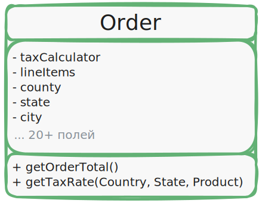
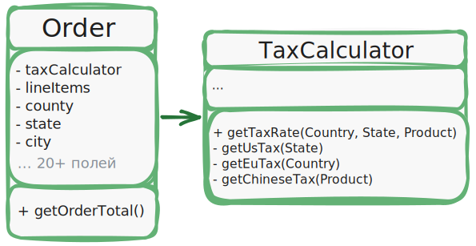

# Инкапсулируйте то, что меняется

> _Определите аспекты программы, класса или метода, которые меняются чаще всего,
> и отделите из от того, что остаётся постоянным._

Этот принцип преследует единственную цель - уменьшить последствия, вызываемые изменениями.

Представьте, что ваша программа - это корабль, а изменения - коварные мины, которые его подстерегают.
Натыкаясь на мину, корабль заполняется водой и тонет.

Зная это, вы можете разделить корабль на независимые секции, проходы между которыми можно наглухо задраивать.
Теперь при встрече с миной корабль останется на плаву. Вода затопит лиь одну секцию, оставив остальные без изменений.

Изолируя изменчивые части программы в отдельных модулях, классах или методах, вы уменьшаете количество кода,
который затронут последующие изменения.
Следовательно, вам нужно будет потратить меньше усилий на то, чтобы привести программу в рабочее состояние, отладить
и протестировать изменившийся код. Где меньше работы, там меньше стоимость разработки. А где меньше стоимость,
там и преимущество перед конкурентами.

## Пример инкапсуляции на уровне метода

Представьте, что вы разрабатываете интернет-магазин. Где-то внутри вашего кода может существовать метод `getOrderTotal`,
который рассчитывает финальную сумму заказа, учитывая размер налога.

Мы можем предположить, что код вычисления налогов, скорее всего, будет часто меняться.
Во-первых, логика начисления налога зависит от страны, штата и даже города, в котором находится покупатель.
К тому же размер налога непостоянен: власти могут менять его, когда вздумается.

Из-за этих изменений вам постоянно придётся трогать метод `getOrderTotal`, который, по правде, не особо интересуется 
*деталями* вычисления налогов.

```java
import java.math.BigDecimal;

public BigDecimal getOrderTotal(Order order) {
    BigDecimal total = order.getLineItems().stream()
            .map(item -> item.getPrice()
                    .multiply(BigDecimal.valueOf(item.getCount())))
            .reduce(BigDecimal.ZERO, BigDecimal::add);

    if ("US".equals(order.getCounty().getAlpha2Code())) {
        total = total.add(
                total.multiply(new BigDecimal("0.07"), MathContext.DECIMAL64)
        );
    } else if ("EU".equals(order.getCounty().getAlpha2Code())) {
        total = total.add(
                total.multiply(new BigDecimal("0.20"), MathContext.DECIMAL64)
        );
    }

    return total.setScale(2, RoundingMode.HALF_EVEN);
}
```

> _**До рефакторинга**: правила вычисления налогов смешаны с основным кодом метода._

Здесь вы можете вынести логику вычисления налогов в собственный метод, скрыв детали от оригинального метода.

```java
import java.math.BigDecimal;

public BigDecimal getOrderTotal(Order order) {
    BigDecimal total = order.getLineItems().stream()
            .map(item -> item.getPrice()
                    .multiply(BigDecimal.valueOf(item.getCount())))
            .reduce(BigDecimal.ZERO, BigDecimal::add);

    BigDecimal taxRate = getTaxAmount(order.getCounty());

    return total.add(
            total.multiply(taxRate, MathContext.DECIMAL64)
    ).setScale(2, RoundingMode.HALF_EVEN);
}

public BigDecimal getTaxAmount(Country county) {
    if ("US".equals(county.getAlpha2Code())) {
        return new BigDecimal("0.07");
    } else if ("EU".equals(county.getAlpha2Code())) {
        return new BigDecimal("0.20");
    } else {
        return BigDecimal.ZERO;
    }
}
```

> _**После рефакторинга**: размер налога можно получить, вызвав отдельный метод._

Теперь изменения налогов будут изолированы в рамках одного метода.
Более того, если логика вычисления налогов станет ещё более сложной,
вам будет легче и правильнее извлечь этот метод в собственный класс.

## Пример инкапсуляции на уровне класса

Извлечь логику налогов в собственный класс? Если логика налогов стала слишком сложной, то почему бы и нет?

<p align="center"></p>

> _**До рефакторинга**: вычисление налогов в классе заказов._

Объекты заказов станут делегировать вычисление налогов отдельному объекту-калькулятору налогов.

<p align="center"></p>

> _**После рефакторинга**: вычисление налогов скрыто в классе-калькуляторе._

```java
import java.math.BigDecimal;

public BigDecimal getOrderTotal(Order order) {
    BigDecimal total = order.getLineItems().stream()
            .map(item -> item.getPrice()
                    .multiply(BigDecimal.valueOf(item.getCount())))
            .reduce(BigDecimal.ZERO, BigDecimal::add);

    BigDecimal taxRate = taxCalulator.getTaxRate(order.getCounty(), order.getState(), order.getProduct());

    return total.add(
            total.multiply(taxRate, MathContext.DECIMAL64)
    ).setScale(2, RoundingMode.HALF_EVEN);
}
```