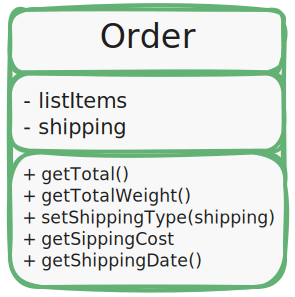
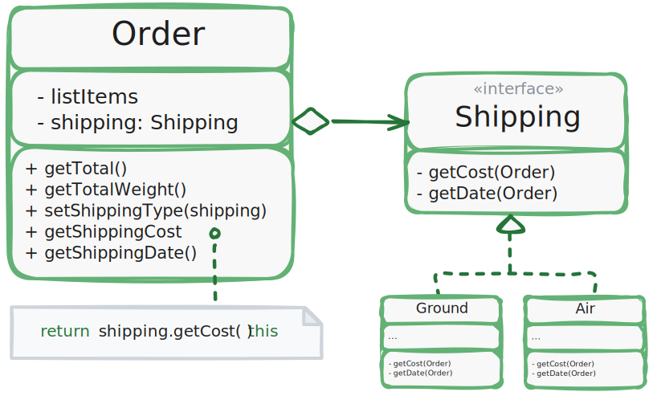

# Принцип открытости/закрытости (Open/Closed Principle)

> *Расширяйте классы, но не изменяйте их первоначальный код*.

Стремитесь к тому, чтобы классы были открыты для расширения, на закрыты для изменения.
Главная идея этого принципа в том, чтобы не ломать существующий код при внесении изменений в программу.

Класс можно назвать открытым, если он доступен для расширения.
Например, у вас есть возможность расширить набор операций или добавить к нему новые поля, создав собственный подкласс.

В то же время, класс можно назвать закрытым (а лучше сказать "законченным"),
если он готов для использования другими классами.
Это означает, что интерфейс класса уже окончательно определен и не будет изменяться в будущем.

Если класс уже был написан, одобрен, протестирован, возможно внесён в библиотеку и включен в проект,
после этого пытаться модифицировать его содержимое нежелательно.
Вместо этого вы можете создать подкласс и расширить в нем базовое поведение,
не изменяя код родительского класса напрямую.

Но не стоит следовать этому принципу буквально для каждого изменения.
Если вам нужно исправить ошибку в исходном классе, просто возьмите и сделайте это.
Нет смысла решать проблему родителя в дочернем классе.

## Пример

Класс заказов имеет метод расчёта стоимости доставки, причем способ доставки «зашиты» непосредственно в сам метод.
Если вам нужно будет добавить новый способ доставки, то придется трогать весь класс `Order`.

> _UML-диаграмма класса `Order` до рефакторинга_.

Давайте более детально рассмотрим класс [Order](psi_element://refactoring.before.Order) до того,
как произведем рефакторинг. Более того,
давайте обратим свое внимание на метод [getShippingCost()](psi_element://refactoring.before.Order#getShippingCost).
Код такого класса будет необходимо изменять при добавлении любого нового способа доставки.

Данную проблему можно решить, если будет применить паттерн _Стратегия_.
Для этого нужно выделить способы доставки в собственные классы с общим интерфейсом.

[//]: # (TODO: добавить ссылку на урок с паттерном _Стратегия_.)

> _UML-диаграмма класса `Order` после рефакторинга_.

Внимательно ознакомьтесь с
интерфейсом [Shipping](psi_element://refactoring.after.Shipping)
и классами
[Order](psi_element://refactoring.after.Order),
[Air](psi_element://refactoring.after.Air),
[Ground](psi_element://refactoring.after.Ground)
расположенных в 
[src/refactoring/after](psi_element://refactoring.after),
в который мы поместили наше решение данной проблемы.

Теперь при добавлении нового способа доставки нужно будет реализовать новый класс интерфейса доставки,
не трогая класс заказов. Объект способа доставки в класс заказа будет подавать клиентский код,
который раньше устанавливал способ доставки простой строкой.

Бонус этого решения в том, что расчет времени и даты доставки тоже можно поместить в новые классы,
повинуясь принципу единственной ответственности.