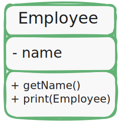
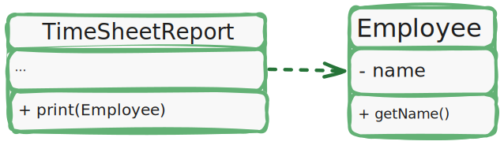

# Принцип единственной ответственности (_Single Responsibility Principle_)

> *У класса должен быть только один мотив для изменения.*

Стремитесь у тому, чтобы каждый класс отвечал только за одну часть функциональности программы,
причем она должна быть полностью инкапсулированию в этот класс (или по-другому "скрыта внутри класса").

Принцип единственной ответственности предназначен для борьбы со сложностью: когда в вашем приложении всего 200 строк,
то дизайн как таковой вообще не нужен. Достаточно аккуратно написать 5-7 методов, и все будет хорошо.
Проблема возникает, когда система растёт и увеличивается в масштабах.
Когда класс разрастается, он просто перестает помещаться в голове.
Навигация затруднятся, на глаза попадаются ненужные детали, связанные с другим аспектом,
а в результате количество понятий начинает превышать мозговой стек, и вы начинаете терять контроль над кодом.

Если класс делает слишком много вещей сразу, вам приходится изменять его каждый раз,
когда одна из этих вещей изменяется. При это есть риск сломать остальные части класса,
которые вы даже не планировали трогать.

Хорошо иметь возможность сосредоточиться на сложных аспектах системы по отдельности.
Но если вам становится сложно это делать - применяйте принцип единственной ответственности,
разделяя ваши классы на части.

## Пример

Класс `Employee` имеет сразу несколько причин для изменения.
Первая связана с основной задачей класса - управлением данными сотрудника.
Но есть и вторая: изменения, связанные с форматированием отчёта для печати, будут затрагивать класс сотрудников.

> *До рефакторинга: класс сотрудника содержит разнородные поведения (методы)*.

Проблему можно решить, выделив операцию печати в отдельный класс.

> *После рефакторинга: лишнее поведение переехало в собственный класс*.
